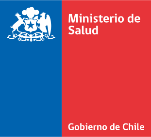

# Plataforma Nacional de Toma de Muestras - Documentación en Línea

La plataforma de toma de muestras es una iniciativa del Ministerio de Salud de Chile para supervisar y registrar adecuadamente las muestras tomadas para la detección del virus SARS CoV-2 y Monkeypox.

Tanto la red pública como la privada están obligadas a utilizar esta plataforma, ya que es una medida para proteger la salud de la población. Además, los laboratorios de análisis para SARS CoV-2 forman parte de los prestadores de salud en el país y, por lo tanto, están sujetos al cumplimiento de la legislación y regulaciones establecidas por el Ministerio de Salud.

En este contexto, esta documentación en línea tiene como objetivo proporcionar información detallada y actualizada sobre la plataforma, incluyendo sus requisitos, uso adecuado y cumplimiento de las regulaciones establecidas.

Además, esta documentación en línea también incluirá información sobre el registro y toma de muestras para el diagnóstico de la monkeypox, una enfermedad infecciosa también incluida en el Ministerio de Salud como una prioridad en la salud pública. Por lo tanto, esta plataforma también servirá como una herramienta para la detección y monitoreo de esta enfermedad, y garantizará un registro adecuado de las muestras tomadas y sus resultados de análisis.

En resumen, esta documentación en línea será un recurso completo y actualizado para los usuarios de la plataforma, que incluirá información sobre SARS-CoV-2 y Monkeypox.