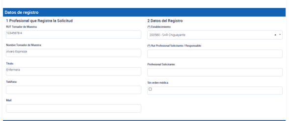

# Desarrollos PNTM
{: .no_toc }

## Tabla de contenido
{: .no_toc .text-delta }
1. TOC
{:toc}

# Toma de muestras: Actualización de funcionalidades para los módulos de COVID-19 y MonkeyPox - Septiembre 2022

Se han realizado algunos arreglos menores en el acceso a la plataforma y se han habilitado dos módulos: uno para COVID-19 y otro para MonkeyPox.

_Imagen de referencia_

**Módulo MonkeyPox:**

- Los perfiles para este módulo están disponibles para todos los tomadores de muestra, pero solo los laboratorios autorizados por el ISP para procesar muestras de PCR MonkeyPox podrán hacer uso del módulo y recibir muestras a través de PNTM.
Los tipos de muestras presentes en MonkeyPox son "Tórula de Lesión" y "Contenido Vesicular".
- El módulo MonkeyPox se encuentra presente con funcionalidades de carga vía interfaz, carga masiva y vía API (solo para el endpoint `/crearmuestrasmp`). La documentación está presente en **APIDOCS**.
Los endpoints de `/recepcionarMuestra` y `/entregaResultado` para MonkeyPox se encuentran en proceso de desarrollo.

**Módulo COVID-19:**

- Con el objetivo de solucionar la carga incorrecta de tomadores de muestra, profesionales responsables y médicos, se han diferenciado los campos de "Tomador de Muestra", "Profesional Responsable" y "Médico Solicitante".
- En el caso de una búsqueda activa, se deberá agregar el RUT del Tomador de muestra y el RUT de un profesional responsable (quien debe ser un profesional).
- Si se trata de un caso de atención médica, aparecerá el campo "Médico Solicitante", donde se debe usar el RUT de un médico registrado en PNTM. De esta manera, desde NC se podrá rastrear quiénes reportan muestras de diagnóstico utilizando perfiles técnicos y no profesionales. El profesional responsable hace referencia al profesional tomador de la muestra o a algún profesional responsable de validar el resultado.

- El desarrollo vía API de esta funcionalidad se implementará en el nuevo endpoint /crearMuestras_v3, el cual también posee la funcionalidad de procesar todas las muestras de manera individual, cargando las muestras correctas y devolviendo las erróneas. Lo anterior viene a solucionar la caída de la carga completa cuando hay solo algunas muestras erróneas. Una vez realizados los desarrollos vía API, se bajará la información vía ordinario y tendrán un mes para migrar al nuevo endpoint `/crearMuestras_v3` y `/recepcionarMuestraV3`.
- Se está trabajando en una modernización de la documentación de PNTM (`pntmdocs`), permitiendo búsqueda por temas, conteniendo preguntas frecuentes e incluyendo cápsulas de ejemplo para cada tipo de proceso que se realiza, entre otras opciones. Además, se utilizará como medio oficial para bajar de forma rápida y oportuna los desarrollos realizados, junto a códigos ejemplo de integraciones vía API de los WS.

Estos desarrollos están planificados para implementarse durante el mes de septiembre de 2022.

# Actualización de la plataforma de toma de muestras - 1 de septiembre de 2022
 
Nuevas funcionalidades:
- Se agregó la variable `Estrategia` al reporte global de solicitudes de antígeno.
- Se agrega la variable `Estrategia` al testeo NO BAC, adicionando los valores `Sintomáticos` y `Residencias Sanitarias`.
- El valor de la variable Estrategia `BAC autotest` se permite tributar solo con marcas de test autorizadas para dicho programa piloto.
- La Estrategia sigue siendo opcional y tiene valor por defecto `Sin Estrategia` tanto para BAC como no BAC.

Corrección de errores:
- Se agregó una restricción para el Rut de pacientes en blanco, ocasionado por un bug que aparecía al seleccionar y deseleccionar el tipo de documento del paciente.
- Se ocultan las variables de recepción y resultado de antígeno desde la interfaz de antígeno.
- Se corrigió un bug que permitía que ciertos establecimientos y laboratorios tributaran incorrectamente muestras de PCR sin RUT de profesional responsable. Se agregó una restricción a la Interfaz, Carga Masiva y API:

Vía interfaz:
Se diferencia entre el RUT Tomador de Muestra y el Rut Profesional Solicitante/ Responsable.

Via Carga Masiva:
Se diferencia entre rut_tomador_muestra y rut_profesional_solicitante (RUT del profesional que es responsable o que solicita la muestra, por ejemplo, médico).

Via API:
No se realiza cambio de nombres de variables para no afectar interoperabilidad en APIDOCS. Pero en caso de utilizar búsqueda_activa = False, deben utilizar el campo rut_responsable con el de tomador de muestra (tal como lo hacían a la fecha) y rut_medico con el RUT del médico solicitante. En caso de elegir búsqueda_activa = True, deben utilizar el campo rut_responsable con el de tomador de muestra (tal como lo hacían a la fecha) y rut_medico con el RUT del profesional responsable.

Estos nombres de variables presentes vía API serán corregidos posteriormente para mayor claridad, al igual que como se realizó en Carga Masiva e Interfaz.
faz
