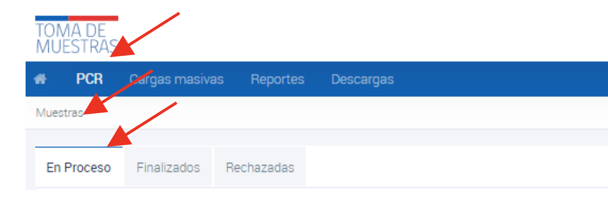

# Recepción digital y derivación de muestras

## Recepción digital y derivación de muestras

Al ingresar, cada laboratorio acreditado y autorizado para realizar el procesamiento de muestras para coronavirus podrá visualizar en el menú “PCR” la situación de las muestras, donde accederá a 3 pestañas:

*Figura 1: Pestañas de estado de muestras.*

- “En Proceso” que corresponde a muestras pendientes de resultado.
- “Finalizados” que corresponde a muestras ya procesadas e informadas.
- “Rechazadas” que corresponde a las muestras que bajo criterio pre-analítico no entraron análisis.

En el caso de que el laboratorio clínico y/o biología molecular no disponga de capacidad de análisis, la muestra puede ser regresada al origen presionando “Devolver solicitud”. Los laboratorios también pueden reenviar directamente las solicitudes a otro laboratorio generando articulación directa.

Para el proceso de recepción y análisis de muestra por el laboratorio, si este laboratorio clínico y/o biología molecular cuenta con capacidad de análisis y puede recibir la muestra, debe presionar “Recepcionar”, con esto pasa a la bandeja de muestras en proceso.

*Figura 2: Proceso de recepción de muestras.*

Si esta muestra viene como derivación de otro laboratorio, este dato aparecerá en el historial de registro de la muestra. Al momento de recepcionar la muestra se debe confirmar esta acción.

*Figura 3: Proceso de confirmación de derivación de otro laboratorio.*
