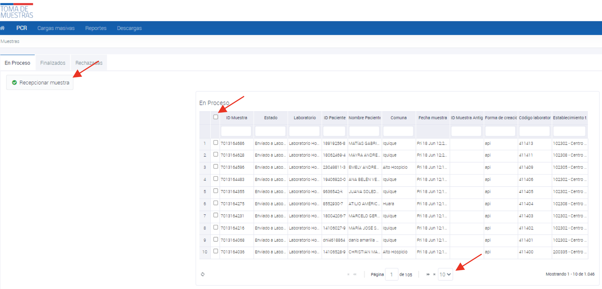

# Recepción masiva de muestras

## Recepción masiva de muestras

A continuación, se presenta el proceso de recepción masiva de muestras en la plataforma ministerial de registro nacional, que permite a los laboratorios clínicos y de biología molecular recibir y procesar muestras de manera eficiente.

1. Ingresar a la plataforma ministerial de registro nacional con las credenciales del laboratorio clínico y/o biología molecular acreditado y autorizado para realizar el procesamiento de muestras para coronavirus.
2. Acceder al menú "PCR" y hacer click en el cuadro general de recepción que se encuentra debajo de la palabra "En Proceso".
3. Seleccionar la opción "Recepción Masiva de Muestras", la cual permite recepcionar 10, 20 o 50 muestras de una vez.
4. Seleccionar todas las muestras en estado "enviadas a laboratorio" que aparecen en plantilla, las cuales serán tomadas en formato de check list.
5. Hacer click en "Recepcionar Muestra" para finalizar el proceso de recepción masiva de muestras.

*Figura 1: Proceso de recepción masiva de muestras.*
