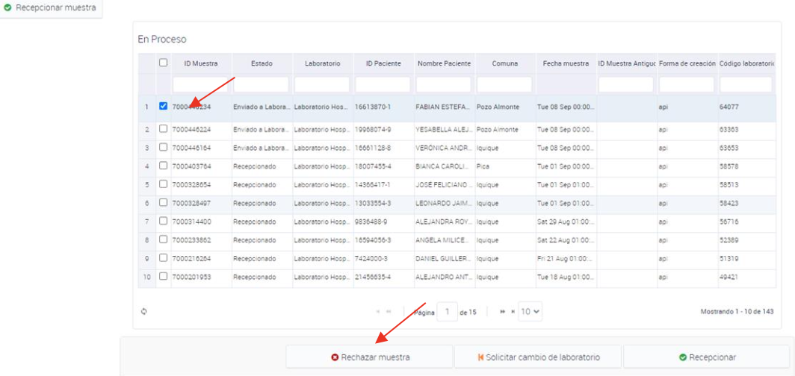

# Rechazar muestra

La opción de "Rechazar muestra" está disponible en la plataforma para aquellos casos en que se presenten determinados criterios. A continuación, se describen los criterios que permiten rechazar una muestra y cómo se lleva a cabo esta acción.

En la plataforma se han definido cinco criterios para rechazar una muestra:

1. Muestra derramada
2. Muestra mal tomada
3. Muestra sin rotular
4. Orden incompleta
5. Discordancia entre el orden de análisis y la muestra

Para efectuar la opción de rechazar una muestra, se debe hacer clic en la muestra correspondiente y luego seleccionar la opción "Rechazar muestra".

*Figura 1: Proceso de rechazar muestras.*
