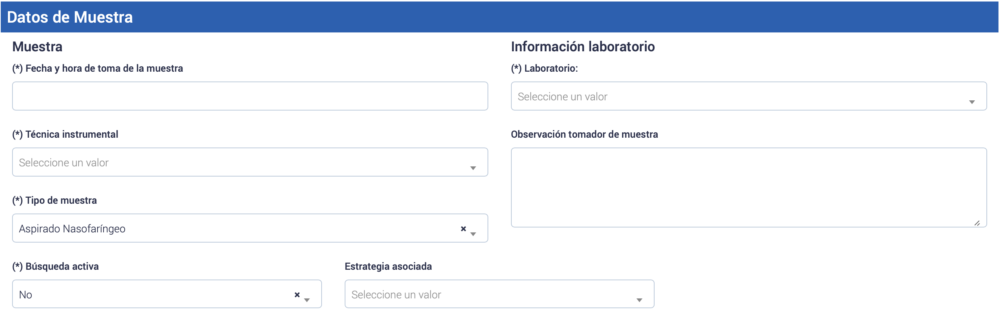
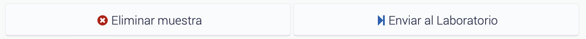

# Creación de muestra PCR vía interfaz web

Para crear muestras utilizando la interfaz de usuario, se debe seguir el siguiente proceso:

1. Acceder al módulo de __PCR__ en el menú de opciones.
2. Seleccionar __Registro__ dentro del submenú correspondiente.
3. Hacer clic en el botón __Crear registro__.

De esta manera, podrás continuar con el proceso de creación de muestras.

_Figura 1: Creación de muestras en la plataforma toma de muestras_

_Figura 2: Botón "Crear registro"_

Después de hacer clic en el botón "Crear registro", se abrirá un formulario donde se debe rellenar los campos solicitados con la información correspondiente de cada muestra que deseas crear.

## Campos del formulario: Creación de muestra

Es importante asegurarse de que de que se llenen todos los campos obligatorios, que están identificados con un asterisco (\*).

### Datos del profesional

_Figura 3: Datos de registro_

__Profesional Tomador de muestra__: Completar los datos del profesional que está registrando la solicitud, como su nombre, establecimiento de trabajo. Si el profesional que está registrando la solicitud de toma de muestra trabaja en más de un establecimiento, debe indicar desde cuál de estos está realizando el procedimiento en el formulario correspondiente.

__Profesional responsable__: Ingresar los datos del profesional que solicita la toma de la muestra, como su RUN (sin punto y con guión) y cualquier otra información necesaria.

__Médico Solicitante__

### Datos del paciente

_Figura 4: Datos del paciente_

__N° Epivigila__: En caso de que se trate de un caso notificado, se debe completar el número de Epivigila.

__Información del paciente__: Registrar los datos del paciente, su nombre completo, fecha de nacimiento, número de RUN o pasaporte y otros datos relevantes.

El botón __Obtener datos del paciente__ permite que el sistema autocomplete la información disponible en las bases de datos correspondientes. Sin embargo, es importante que el profesional verifique todos estos datos directamente con el paciente.

### Datos de Muestra

_Figura 5: Datos de muestra_

__Muestra__: Seleccionar la fecha y hora de la toma de muestra, así como el tipo de muestra obtenida y el laboratorio de destino. Operativos BAC, seleccionar "SI" si la muestra se tomó en un operativo BAC y "NO" si se tomó en un centro asistencial regular.

__Información laboratorio__: Seleccionar el laboratorio de destino al que se enviará la muestra. Este laboratorio de destino es establecido previamente por cada Servicio de Salud, y debe ser conocido por cada dirección de Centro Asistencial y sus funcionarios.

### Enviar muestra al laboratorio

_Figura 6: Botones de envío de muestra al laboratorio_

Verificar que toda la información sea correcta y completa antes de enviar la solicitud de toma de muestra. Una vez que se hayan completado todos los campos necesarios, hacer clic en el botón "Enviar muestra al laboratorio".