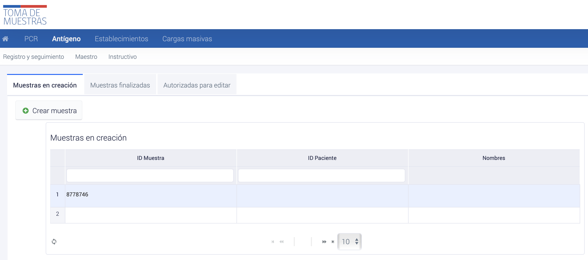
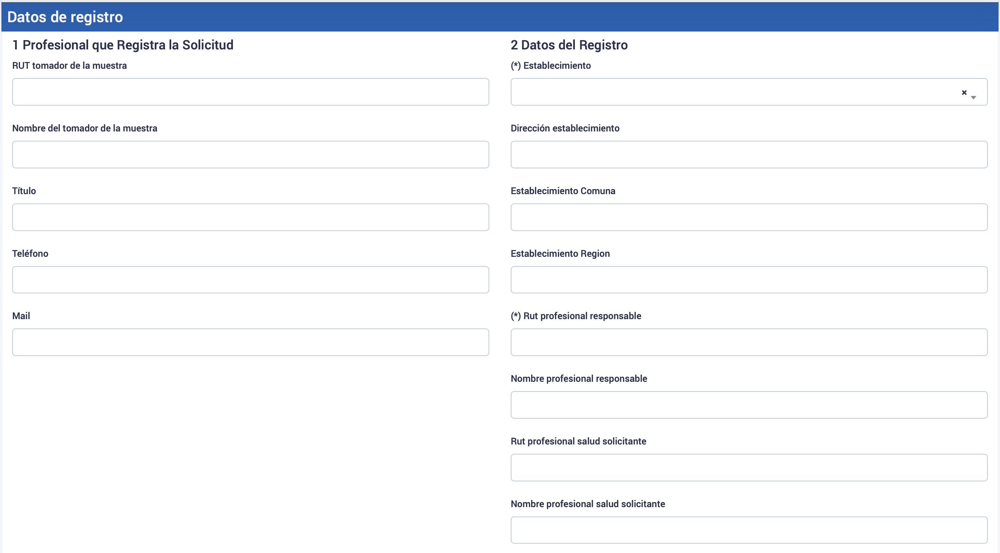
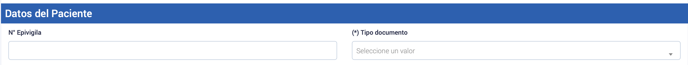
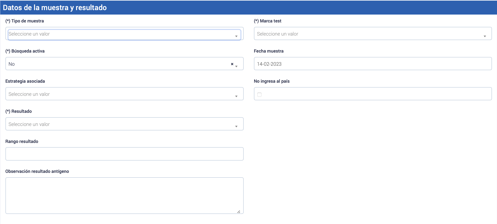
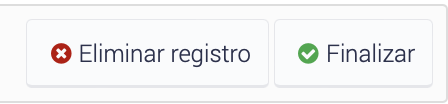

# Creación y resultado de Muestras AG via interfaz web

Para crear muestras utilizando la interfaz de usuario, se seguir el siguiente proceso:1. Acceder al módulo de __Antígeno__ en el menú de opciones.2. Seleccionar __Registro y seguimiento__ dentro del submenú correspondiente.3. Hacer clic en el botón __Crear muestra__. De esta manera, podrás continuar con el proceso de creación de muestras.4.  

_Imagen de referencia para la creación de muestras de Antígeno en la plataforma toma de muestras_

_Imagen del botón "Crear registro"_

Después de hacer clic en el botón "Crear registro", se creará un id de muestra, el cual si se hace click se abrirá un formulario donde se debe rellenar los campos solicitados con la información correspondiente de cada muestra que deseas crear.

### Campos del formulario: Creación de muestra

Es importante asegurarse de que se llenen todos los campos obligatorios, que están identificados con un asterisco (\*).

#### Datos de registro

_Imagen de referencia de la sección datos de registro del formulario_

__Profesional Tomador de muestra__ Completar los datos del profesional que está registrando la solicitud, como su nombre, establecimiento de trabajo. Si el profesional que está registrando la solicitud de toma de muestra trabaja en más de un establecimiento, debe indicar desde cuál de estos está realizando el procedimiento en el formulario correspondiente.

__Profesional responsable__ Ingresar los datos del profesional que solicita la toma de la muestra, como su RUN (sin punto y con guión) y cualquier otra información necesaria.

__Médico Solicitante__

#### Datos del paciente

_Imagen de referencia de la sección datos del Paciente del formulario de registro_

__N° Epivigila__En caso de que se trate de un caso notificado, se debe completar el número 

__Tipo de documento__Actualmente PNTM cuenta con los siguientes métodos de registro asociados al tipo de documento del paciente registrado en Antígenos:•&nbsp;&nbsp;&nbsp;&nbsp; Run•&nbsp;&nbsp;&nbsp;&nbsp; Pasaporte•&nbsp;&nbsp;&nbsp;&nbsp; Sin Documentación•&nbsp;&nbsp;&nbsp;&nbsp; DNI•&nbsp;&nbsp;&nbsp;&nbsp; Ficha Clínica•&nbsp;&nbsp;&nbsp;&nbsp; Recién Nacido

Para lo cual, en base al tipo de usuario a testear se detallan los posibles tipos de registro del tipo de documento y la jerarquía a utilizar en caso de no contar con algún tipo de documento

| Paciente | Identificador estándar | Alternativo ||:---------------------:|:----------------------:|:--------------------------------------------------------------------------------------------------------------------:|| Chilenos | RUN definitivo | Pasaporte: número; Ficha clínica: FC. + número; NO USAR RUN PROVISORIO || Extranjeros | RUN definitivo | Pasaporte: número; DNI: DNI. + número (argentinos, peruanos, otros); Ficha clínica: FC. + número; NO USAR RUN PROVISORIO || Recién nacidos | RUN definitivo | Comprobante de parto: CP. + número; Ficha clínica: FC. + número; NO USAR RUN PROVISORIO || Otro tipo de paciente | Dinámico | Fichas clínicas: FC. + número; DNI: DNI. + número (argentinos, peruanos, otros); NO USAR RUN PROVISORIO |_Tabla: tipos de documento por jerarquía de registro_

*   Ciudadanos chilenos: Utilizar siempre como primera opción el __RUN__, independiente que sean viajeros que vienen del extranjero.
*   Extranjeros: Utilizar como primera opción el __RUN definitivo__ (si lo posee). En segundo lugar, el número de pasaporte y como última opción la Identificación local del sujeto.
*   Recién nacidos: Para realizar el registro de pacientes __recién nacidos__ la regla corresponde a registrar como primera instancia el RUN, luego si el recién nacido no cuenta con este registro se procede a registrar el número de parto o ficha de recién nacido.
*   Casos excepcionales: En que un caso no tenga ningún tipo de identificación y no entregue información al respecto, se podría utilizar, por ejemplo, el número del dato de atención de urgencia o ficha clínica, utilizando tipo documento = “__Ficha Clínica__”.

__Información del paciente__Registrar los datos del paciente, su nombre completo, fecha de nacimiento, número de RUN o pasaporte y otros datos relevantes.

En caso de ingresar un RUN en la sección de datos del paciente, éste debe ser ingresado sin puntos y con dígito verificador. El botón __Obtener datos del paciente__ permite que el sistema autocomplete la información disponible en las bases de datos correspondientes. Sin embargo, es importante que el profesional verifique todos estos datos directamente con el paciente.

A continuación, se detallan cada uno de los datos que deben ser ingresados en la sección de datos de paciente

| Columna | Tipo de dato | Descripción | Restricciones ||:----------------:|:------------:|:-----------------------------------------------------------------------:|:---------------------------------------------------------:|| N Epivigila | Número | Id Epivigila | Opcional || RUN o Pasaporte | Texto | Número de identificación del paciente | Obligatorio y válido en caso de ser RUN || Tipo documento | Texto | RUN; PASAPORTE; DNI PAIS DE ORIGEN; SIN DOCUMENTACION; N° FICHA CLINICA | Obligatorio || Nombres | Texto | Nombres del paciente | Obligatorio || Apellido paterno | Texto | Apellido paterno del paciente | Obligatorio || Apellido materno | Texto | Apellido Materno del paciente | Obligatorio, en caso no poseer indicar: "." || Sexo | Texto | Sexo del paciente | Obligatorio y solo podrá ser M, F, Intersex o Desconocido || Dirección | Texto | Dirección del paciente | Obligatorio, Ejemplo: Avenida El Bosque. || Teléfono | Número | Número de teléfono del paciente | Obligatorio || Edad | Número | Edad del paciente | Obligatorio || Comuna | Número | Comuna del paciente | Obligatorio, Debe ser una comuna valida del listado || N Residencia | Texto | Numero de identificador de la calle/avenida | Obligatorio, Ejemplo: 130 || Dpto. Residencia | Texto | Numero de identificador del dpto. casa del paciente | Opcional, Ejemplo: 22A || Población, Villa | Texto | Población de residencia del paciente | Opcional, Ejemplo: Villa Magisterio || Vía Residencia | Texto | Tipo de vía residencia del paciente | Obligatorio, Debe ser una vía valida del listado || Paciente mail | Texto | Dirección de correo electrónico | Obligatorio |_Tabla: Datos paciente requeridos_

#### Datos de la muestra y resultado

_Imagen de referencia de la sección Datos de la muestra y resultado del formulario de registro_

El profesional deberá ingresar de forma obligatoria todos los campos indicados en asterisco, debiendo completar la información indicada en la siguiente tabla.

| Tipo de muestra | Texto | Descripción | Restricciones ||--------------------|----------|------------------------------------------------|------------------------------------------------------------------|| Tipo de muestra | Texto | Tórula nasofaríngea; Tórula Nasal | Obligatorio || Búsqueda activa | Booleano | 0 = No; 1 = Si | Obligatorio || Resultado | Texto | Positivo; Negativo; No concluyente | Obligatorio || Marca Test | Texto | Marca de la prueba | Obligatorio, debe ser proveniente del listado disponible en PNTM || Fecha muestra | Fecha | Fecha en que se crea la solicitud | Obligatorio || No ingresa al país | Booleano | 0 = SI ingresa al país; 1 = NO ingresa al país | Obligatorio |_Tabla: Datos de la muestra y resultado_

#### Finalizar la creación del registro

_Imagen de referencia de botones Eliminar registro y Finalizar de formulario de registro_

Se recomienda verificar los datos luego de haber realizado la lectura e interpretación de los resultados, para así completar el registro haciendo click en __Finalizar__

## Informe de resultado para test antígeno

Una vez finalizado, deberán subir en la plataforma y pinchar __“INFORME DE RESULTADO PARA TEST ANTIGENO”__ para descargar informe. 

Una vez pinchado se desplegará informe para que pueda ser impreso y firmado a mano alzada por profesional responsable del análisis de la muestra, esto para ser entregado al paciente.