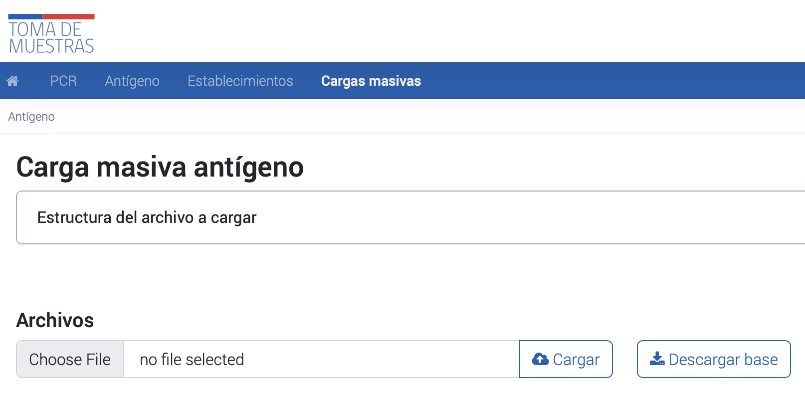

# Carga masiva de muestras y resultado de Test de antígeno

# Carga masiva de muestras y resultado de Test de antígeno

El siguiente instructivo explica los pasos necesarios para realizar cargas masivas de resultados de antígeno a través de la plataforma PNTM. Los usuarios podrán acceder a la sección de cargas masivas, descargar una planilla base con los campos solicitados, ingresar los datos requeridos y cargar el archivo de forma satisfactoria.

## Instrucciones de la carga masiva

_Foto de referencia de la sección de cargas masivas por la interfaz_

1.   Es necesario acceder al módulo de "Cargas Masivas" dentro de la plataforma y seleccionar la sección "Antígeno".
2.   En el botón desplegable "Estructura del archivo a cargar" se pueden visualizar los campos solicitados en la Planilla Base de toma de muestras, incluyendo el nombre de la columna, el tipo de dato, la descripción y las restricciones correspondientes.
3.   La Planilla Base se encuentra disponible para su descarga en formato Excel, a través del botón "Descargar base" ubicado debajo de la descripción de los campos.
4.   Para ingresar los datos correspondientes a cada muestra, es necesario incluir al menos todos los datos obligatorios en la fila 2 del archivo Excel, y guardar el archivo una vez completado.
5.   En la plataforma, se debe seleccionar el botón "Seleccionar archivo" y elegir el archivo deseado para luego hacer clic en "Subir archivo" y completar la carga de forma satisfactoria.

## Estructura del archivo a cargar

La tabla que se presenta a continuación muestra la estructura de los datos que se deben rellenar en el archivo Excel. Cada columna representa un tipo de dato y la descripción que indica su función dentro del formulario. Además, se especifican las restricciones que se deben cumplir en cada columna para asegurar que la carga masiva sea procesada correctamente. Los usuarios deben incluir al menos todos los datos obligatorios descritos en la sección "Campos Solicitados".

| Columna | Tipo de dato | Descripción | Restricciones ||------------------------------|--------------|--------------------------------------------------------------------------------------------------------------------------------------------------------------------------------------------------------------------------------------------------------------------------------------------------------------------------------------------------------|-----------------------------------------------------------------------------------------------------------------------------------------------------------------------------------------------------------------------------------------------------------------------------------------------------------------------------------------------------------|| run\_pasaporte_ | Varchar | Numero de identificacion del paciente | Obligatorio En caso de ser RUN debe ser valido || paciente\_tipodoc_ | Varchar | tipo de dumento de identificacion del paciente Ejemplo: RUN PASAPORTE DNI PAIS DE ORIGEN SIN DOCUMENTACION N° FICHA CLINICA | Obligatorio Debe estar dentro de los valores aceptados: 1. RUN: run\_pasaporte 2. PASAPORTE: run\_pasaporte y paciente\_ext\_paisorigen 3. DNI PAIS DE ORIGEN: run\_pasaporte y paciente\_ext\_paisorigen 4. SIN DOCUMENTACION: No se debe asignar valor a run\_pasaporte y paciente\_ext\_paisorigen 5. N° FICHA CLINICA: run\_pasaporte y paciente\_ext\_paisorigen || paciente\_nombres_ | Varchar | Nombres del paciente | Obligatorio || paciente\_ap\_pat_ | Varchar | Apellido paterno del paciente | Obligatorio || paciente\_ap\_mat_ | Varchar | Apellido Materno del paciente | Obligatorio || paciente\_direccion_ | Varchar | Direccion del paciente | Obligatorio Ejemplo: Avenida El Bosque. || paciente\_telefono_ | Numero | Numero de telefono del paciente | Obligatorio || paciente\_edad_ | Date | Edad del paciente | Obligatorio || paciente\_comuna_ | Numero | Codigo de la comuna del paciente | Obligatorio Debe ser una comuna valida del maestro || paciente\_numero\_direccion_ | Varchar | Numero de identificador de la calle/avenida | Obligatorio Ejemplo: 130 || paciente\_depto\_direccion_ | Varchar | Numero de identificador del dpto. casa del paciente | No obligatorio Ejemplo: 22A || paciente\_poblacion\_villa_ | Varchar | Población de residencia del paciente | Obligatorio Ejemplo: Talca || paciente\_via\_direccion_ | Varchar | tipo de via residencia del paciente | Obligatorio debe estar dentro del maestro via\_dirección Ejemplo: 1 || paciente\_mail_ | Varchar | Dirección de correo electrónico | Obligatorio || paciente\_ext\_paisorigen_ | Numero | Codigo del pais de origen del paciente | Obligatorio si paciente\_tipodoc es igual a "PASAPORTE ", "DNI PAIS DE ORIGEN", "N° FICHA CLINICA" o "SIN DOCUMENTACION" Debe ser un codigo valido del maestro paises || rut\_profesional\_responsable_ | Varchar | RUN del responable de la muestra | Obligatorio Debe existir en la base de profesionales || rut\_medico | Varchar | RUN del medico que solicita la muestra | Opcional || cod\_deis_ | Varchar | Codigo DEIS del Establecimiento | Obligatorio Debe existir en el maestro cod\_deis || epivigila_ | Varchar | Codigo epivigila | No obligatorio || tipo\_muestra_ | Varchar | Tipo de muestra realizada Ejemplo: Tórula nasofaríngea Tórula nasal | Obligatorio Debe ser: Tórula nasofaríngea o Tórula nasal || fecha\_muestra\_date_ | Date | Fecha en que se crea la solicitud | Obligatorio || busqueda\_activa_ | Boolean | Tipo de busqueda Valores: 0 = No 1 = Si | Obligatorio || resultado_ | Varchar | Valor del resultado de la muestra | Obligatorio Debe ser: Positivo, Negativo, No concluyente || codigo\_marca\_test\* | Varchar | Marca de la prueba | Obligatorio debe estar dentro del maestro marca\_test || no\_ingresa\_pais | Boolean | Marca que indica ingreso efectivo al país Valores: 0 = SI ingresa al país 1 = NO ingresa al país | No es Obligatorio || estrategia | Texto | Indica la estrategia asociada a la muestra de antígeno Valores cuando busqueda activa es 1: BAC Punto de Entrada BAC Brotes BAC Autotest Valores cuando busqueda activa es 0: Sintomáticos Residencias Sanitarias Atención médica | No es Obligatorio || subestrategia | Texto | Indica la subestrategia asociada a la muestra de antígeno con estrategia BAC Brotes Valores: BAC Escolar BAC ELEAM BAC Mejor Niñez/SENAME BAC Centros Penitenciarios BAC Laboral OAL/AD/Centros de Salud BAC centro de diálisis BAC entorno prioritario BAC otros hogares BAC recintos de FFAA BAC viviendas colectivas y campamentos BAC comunitarios | No es Obligatorio || observacion\_muestra | Varchar | Observación resultado antígeno | Opcional |

## Errores en la carga masiva

La plataforma Nacional de Toma de Muestras detalla los posibles errores que pueden ser indicados por el sistema al momento de subir una planilla de carga masiva a la plataforma, así como los errores que no detectará el sistema pero que pueden afectar la calidad de la información. El objetivo es verificar estas condiciones para poder subir una planilla de carga masiva de forma correcta a la PNTM.

### Errores indicados por el sistema

Los posibles errores que pueden ser indicados por el sistema al momento de subir una planilla de carga masiva a la plataforma son:

*   __Campo obligatorio en blanco__: este error se presenta al dejar en blanco campos que son de carácter obligatorio, como el RUN\_pasaporte.
*   __RUN Paciente Incorrecto__: este error se presenta cuando la planilla posee algún RUN inválido. Cabe destacar que el RUN debe ser escrito sin puntos y con guion.
*   __Rut Profesional\_sis o Rut\_medico no existente en base de profesionales__: este error se presenta al ingresar un rut en el campo rut\_profesional o rut\_medico que no se encuentre en la base de profesionales.
*   __Rut\_medico en blanco__: este error se presenta al dejar en blanco el campo rut\_medico, ya que la plataforma fue diseñada en un principio para recibir muestras de antígenos de pacientes sintomáticos provenientes de alguna médica.
*   __Fecha diferente a la fecha actual__: este error se presenta al ingresar una fecha de muestra diferente a la fecha actual.
*   __Campo no figura dentro del conjunto de datos__: este error se presenta al ingresar información que no esté contenida dentro del maestro de datos. En dicho caso se indicará por pantalla el conjunto de datos aceptado.

### Errores no indicados por el sistema

Los errores no indicados por el sistema son aquellos que pueden afectar directamente el tratamiento de los datos y la calidad de la información, por lo que es importante verificar dicha información antes de ser subida. Algunos ejemplos de estos errores son:

*   Ingreso de código DEIS de otro establecimiento.
*   Ingreso erróneo de resultado.
*   Ingreso de RUN de otro paciente.
*   Ingreso de ID de otra comuna.
*   Ingreso de código EPIVIGILA erróneo.
*   Ingreso erróneo de tipo de búsqueda (activa o no activa).

### Excepciones

PNTM detalla algunas especificaciones a considerar en diversos campos obligatorios al momento de realizar una carga masiva en la plataforma en circunstancias excepcionales. Por ejemplo:

*   Dirección o teléfono del paciente: en caso de que no se posea la dirección detallada del paciente debido a circunstancias en las cuales sea dificultoso poseer este tipo de información, se deberán considerar algunas indicaciones específicas dependiendo del resultado de la muestra.
*   Pacientes menores de edad: en caso de que se trate de pacientes menores de edad, se debe ingresar el RUN del apoderado en el campo rut\_medico.
*   En caso de fallecimiento del paciente: si el paciente ha fallecido, se debe indicar en el campo estado\_paciente la opción "Fallecido".
*   Muestras en contexto de pesquisa activa: en caso de que las muestras sean tomadas en el contexto de pesquisa