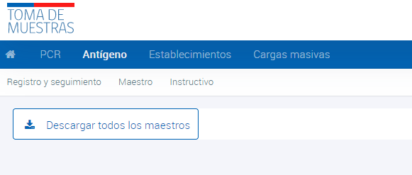

# Descarga de datos maestros - Antígenos

Como una opción, se puede descargar el archivo de datos maestros desde la plataforma. Para ello, se debe acceder al módulo "Antígeno", seleccionar la sección "Maestro" y descargar la información desde el botón "descargar todos los maestros". El archivo descargado contendrá todos los datos maestros necesarios en formato Excel para ingresar la información de forma correcta en la planilla base.

_Figura 1: Descarga de datos maestros - Antígenos_

A continuación se detalla la lista de los datos maestros disponibles en el archivo Excel descargado:

- **Comunas**: Disponible para el campo paciente_comuna, indicando la columna id_comuna de la planilla maestro de datos
- **Sexo**: Disponible para el campo paciente_sexo, indicando la columna clave de la planilla maestro de datos
- **Establecimiento público**: Disponible para el campo cod_deis, indicando la columna cod_deis de la planilla maestro de datos
- **Establecimiento privado**: Disponible para el campo cod_deis, indicando la columna cod_deis de la planilla maestro de datos
- **Resultado antígeno**: Disponible para el campo resultado, indicando la columna resultado de la planilla maestro de datos
- **Tipo de documento antígeno**: Disponible para el campo tipo_pacientedoc, indicando la columna tipo_documento de la planilla maestro de datos
- **Vía dirección**: Disponible para el campo paciente_via_direccion, indicando la columna tipo_documento de la planilla maestro de datos
- **Tipo de muestra antígeno**: Disponible para el campo tipo_muestra, indicando la columna tipo_muestra de la planilla maestro de datos
- **Marca de test**: Disponible para el campo codigo_marca_test, indicando la columna clave de la planilla maestro de datos