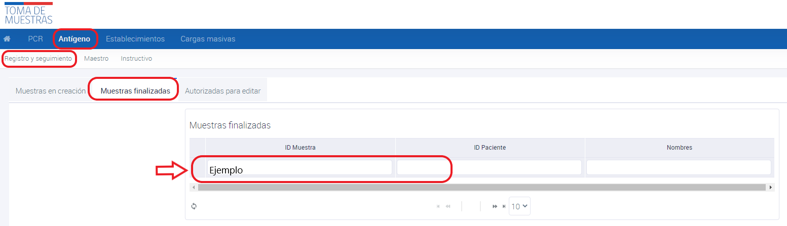

# Período legal de eliminación de muestras de Antígenos

- La eliminación de muestras de antígeno está permitida luego de cumplir un período legal de 3 días. Esta acción es realizada por el profesional tomador de muestra a través de su perfil.

Para eliminar una muestra de antígeno, siga los siguientes pasos:
- Ingresar a **Antigenios**
- Ingresar a **Registro y seguimiento**
- Dirigirse a la sección de **muestras finalizadas**
- Seleccionar la muestra que se desea eliminar
- Hacer clic en **eliminar registro**

_Figura 1: Sección Muestras finalizadas_

# Autorización para eliminación de muestras PCR

La eliminación de las muestras PCR solo es posible con autorización previa de la Mesa de Ayuda PNTM. Para solicitarla, envíe un correo electrónico a [mesadeayudapntm@minsal.cl](mailto:mesadeayudapntm@minsal.cl) o llame al teléfono +56 9 99424751. Debe proporcionar los antecedentes detallados que justifiquen la eliminación de la muestra.

La eliminación de muestras debe llevarse a cabo con responsabilidad. Se aconseja efectuar la eliminación de muestras solo en casos excepcionales y cuando sea absolutamente necesario, ya que puede impactar el seguimiento y trazabilidad de los pacientes.
