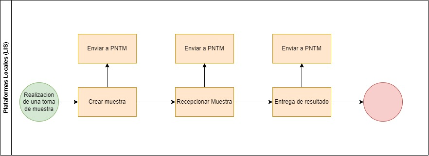
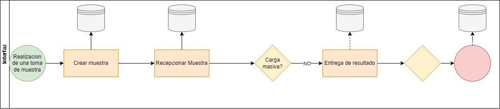
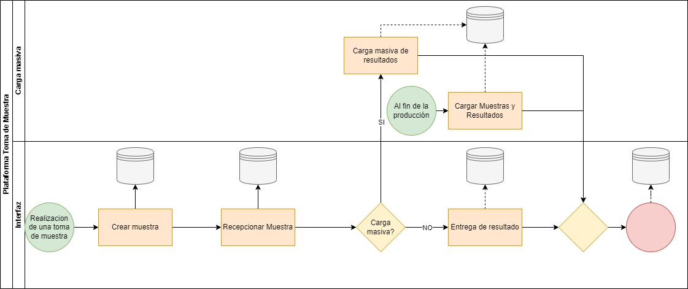

# Registro de muestras biologicas
{: .no_toc }

## Tabla de contenido
{: .no_toc .text-delta }

1. TOC
{:toc}

El registro de muestras es un proceso fundamental en el ámbito de la salud, que permite un control riguroso de los pacientes y una gestión eficiente de los recursos. La información recolectada es clave para la detección de enfermedades y la toma de decisiones médicas.

Existen tres maneras de ingresar muestras a la Plataforma Nacional de Toma de Muestras (PNTM): mediante la interfaz web, carga masiva y API. 

El registro mediante interfaz corresponde a toda muestra que es ingresada directamente desde [tomademuestras.minsal.cl](https://tomademuestras.minsal.cl/), dentro del registro de interfaz existen tres hitos de registro importantes, los que corresponden a Creación de muestras, Recepción de muestras y Entrega de resultados. 

Por otro lado, la carga masiva de muestras y/o resultados es una opción adicional a la carga de información por interfaz o por medio de interoperabilidad. Esto ayuda a laboratorios que no cuentan con la infraestructura necesaria para el registro de información.

El registro mediante API corresponde a toda muestra que es ingresada mediante el uso de Web Service puesto a disposición para generar interoperabilidad entre laboratorios y PNTM. Dentro de los servicios disponibles para el consumo se encuentra la creación de muestras, recepción de muestras y entrega de resultados.

# Ingreso vía interfaz web 

El registro mediante interfaz corresponde a toda muestra que es ingresada directamente desde [tomademuestras.minsal.cl](https://tomademuestras.minsal.cl/), dentro del registro de interfaz existen tres hitos de registro importantes, los que corresponden a Creación de muestras, Recepción de muestras y Entrega de resultados.

## Creación de muestras

El proceso de creación de muestras se realiza por el profesional de toma de muestra y debe registrarse de manera sincrónica en la plataforma PNTM con el usuario respectivo. Para llevar a cabo este proceso, el profesional debe completar todos los campos solicitados por la plataforma.

## Recepción de muestras

La recepción de muestras es un proceso llevado a cabo por el laboratorio receptor. Un profesional designado debe ingresar a la plataforma con el perfil de acceso del laboratorio y generar el acto de recepción de muestra. Este proceso también debe registrarse de manera sincrónica en la plataforma.

## Entrega de resultados

La entrega de resultados se realiza en el laboratorio y cada muestra procesada debe ser registrada en PNTM. Para llevar a cabo este proceso, un profesional designado debe ingresar a la plataforma con el perfil de usuario de laboratorio y entregar los resultados de manera sincrónica con el acto de entrega.

# Carga Masiva

La carga masiva de muestras y/o resultados es una opción adicional a la carga de información por Interfaz o por medio de Interoperabilidad. Esto ayuda a laboratorios que no cuentan con la infraestructura necesaria para el registro de información.

Existen dos métodos para la carga masiva de información: Carga masiva de resultados y Carga masiva de muestras y resultados. 

## Carga masiva de muestras

Permite a los profesionales de laboratorio cargar un archivo Excel con el identificador de la muestra y el resultado en la columna adjunta. 

## Carga masiva de muestras y resultados

Permite el registro de ambas informaciones en un solo archivo. Estos métodos ayudan a los laboratorios a registrar la información de manera más rápida.

# Registro vía API
El registro mediante API corresponde a toda muestra que es ingresada mediante el uso de Web Service puesto a disposición para generar interoperabilidad entre laboratorios y PNTM. Dentro de los servicios disponibles para el consumo se encuentra la creación de muestras, recepción de muestras y entrega de resultados.

## Creación de muestras
Dentro de los métodos de servicio disponibles en el Web Service, existe la creación de muestras. Esta opción permite a todo laboratorio crear muestras mediante el uso de API, lo que facilita y apunta a la integración de procesos desde sistemas informáticos locales de laboratorio (LIS) a PNTM, de esta manera se genera cohesión en el registro en ambos sistemas.

## Recepción de muestras
Dentro de los métodos de servicio disponibles en el Web Service, existe la recepción de muestras. Esta opción permite a todo laboratorio recepcionar muestras mediante el uso de API, lo que facilita y apunta a la integración de procesos desde sistemas informáticos locales de laboratorio (LIS) a PNTM, de esta manera se genera cohesión en el registro en ambos sistemas.

## Entrega de resultados
Dentro de los métodos de servicio disponibles en el Web Service, existe la entrega de resultados. Esta opción permite a todo laboratorio entregar resultados mediante el uso de API, lo que facilita y apunta a la integración de procesos desde sistemas informáticos locales de laboratorio (LIS) a PNTM, de esta manera se genera cohesión en el registro en ambos sistemas.

