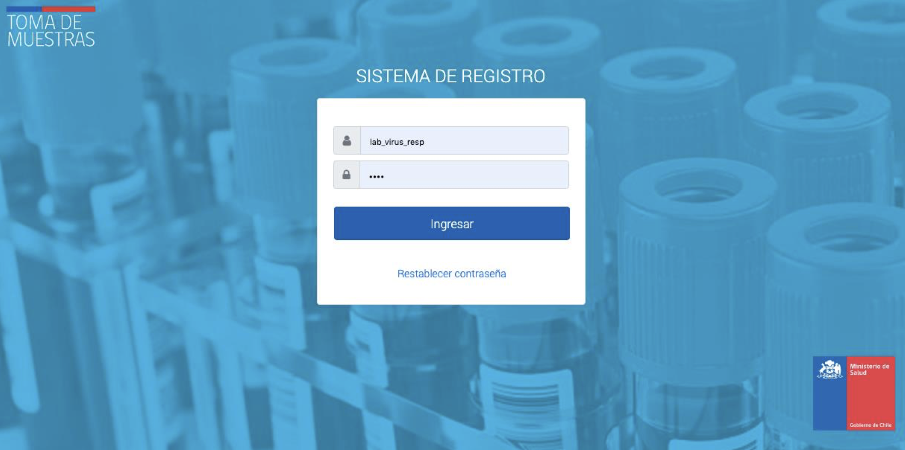
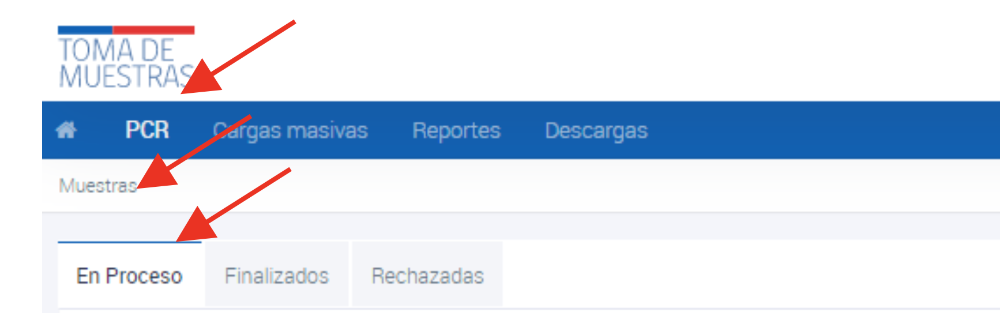
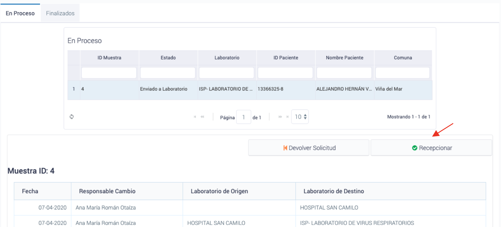
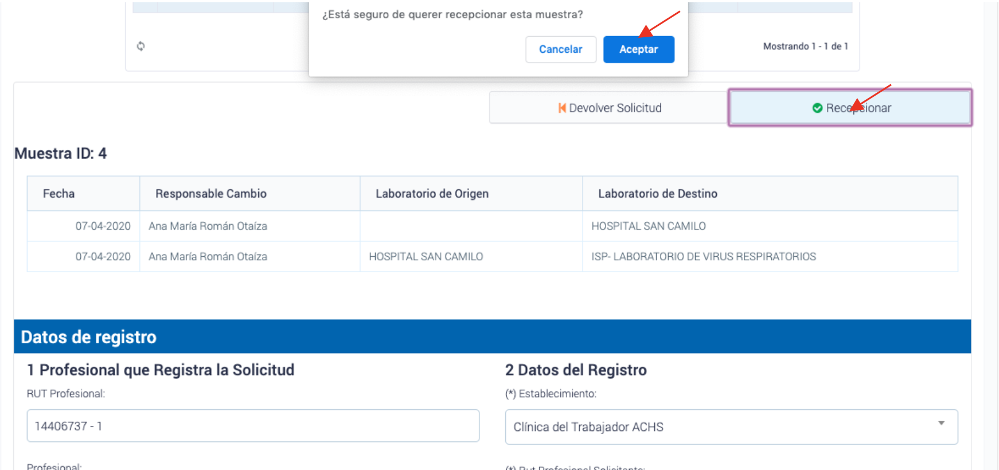
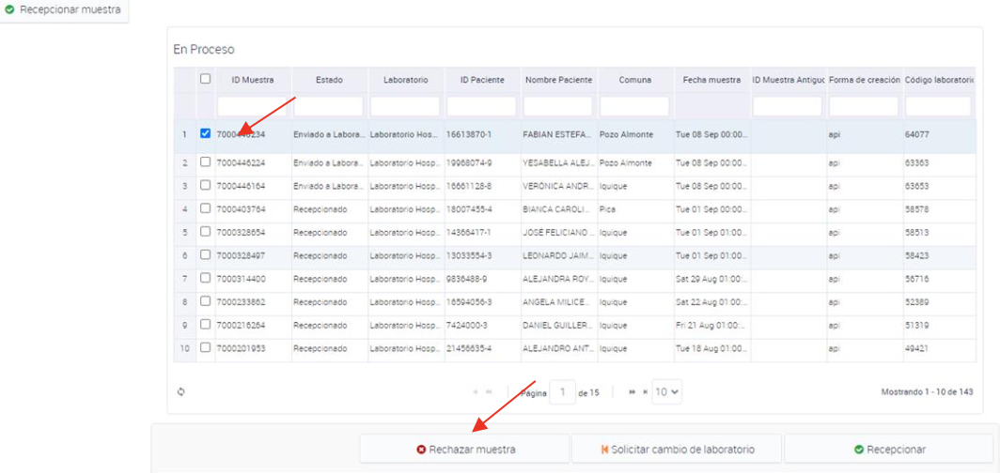
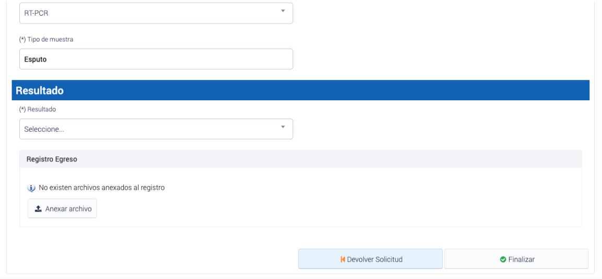
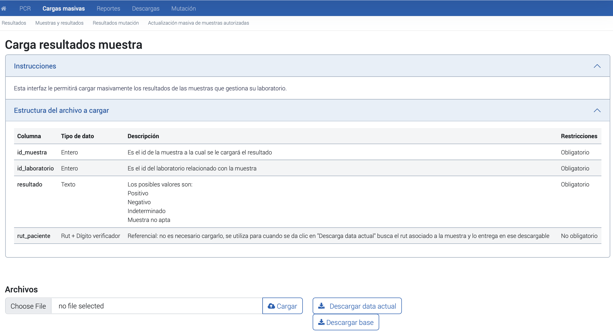
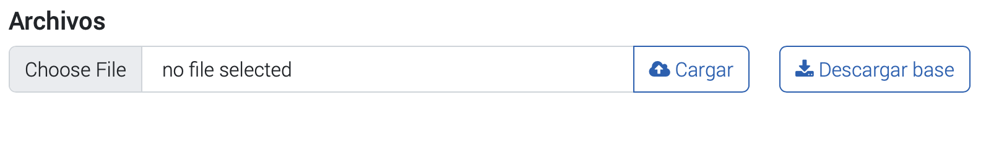

# Registro de muestras biologicas: Laboratorio
{: .no_toc }

## Tabla de contenido
{: .no_toc .text-delta }
1. TOC
{:toc}

# Ingreso a la plataforma

Para acceder a la plataforma ministerial de registro nacional, los profesionales responsables de laboratorio clínico y/o biología molecular deberán utilizar las credenciales de su laboratorio. Una vez que se han ingresado las credenciales, se podrá acceder a todas las funcionalidades y servicios disponibles en la plataforma.

_Imagen de referencia para el ingreso a la plataforma toma de muestra_

# Recepción digital y derivación de muestras

Al ingresar, cada laboratorio acreditado y autorizado para realizar el procesamiento de muestras para coronavirus podrá visualizar en el menú “PCR” la situación de las muestras, donde accederá a 3 pestañas:

_Pestañas: En Proceso, Finalizados y Rechazadas_

-   “**En Proceso**” que corresponde a muestras pendientes de resultado.
-   “**Finalizados**” que corresponde a muestras ya procesadas e informadas.
-   “**Rechazadas**” que corresponde a las muestras que bajo criterio preanalítico no entraron análisis.

En el caso que el laboratorio clínico y/o biología molecular no disponga de capacidad de análisis, la muestra puede ser regresada al origen presionando “Devolver solicitud”. Los laboratorios también pueden reenviar directamente las solicitudes a otro laboratorio generando articulación directa.

Para el proceso de recepción y análisis de muestra por el laboratorio, si este laboratorio clínico y/o biología molecular cuenta con capacidad de análisis y puede recibir la muestra, debe presionar “Recepcionar”, con esto pasa a la bandeja de muestras en proceso.

_Proceso de recepcion de muestras_

Si esta muestra viene como derivación de otro laboratorio, este dato aparecerá en el historial de registro de la muestra. Al momento de recepcionar la muestra se debe confirmar esta acción.

_Proceso de confirmacion de derivacion de otro laboratorio_

# Recepción masiva de muestras
 A continuación, se presenta el proceso de recepción masiva de muestras en la plataforma ministerial de registro nacional, que permite a los laboratorios clínicos y de biología molecular recibir y procesar muestras de manera eficiente.

1.  Ingresar a la plataforma ministerial de registro nacional con las credenciales del laboratorio clínico y/o biología molecular acreditado y autorizado para realizar el procesamiento de muestras para coronavirus.
2.  Acceder al menú "PCR" y hacer click en el cuadro general de recepción que se encuentra debajo de la palabra "En Proceso".
3.  Seleccionar la opción "Recepción Masiva de Muestras", la cual permite recepcionar 10, 20 o 50 muestras de una vez.
4.  Seleccionar todas las muestras en estado "enviadas a laboratorio" que aparecen en plantilla, las cuales serán tomadas en formato de check list.
5.  Hacer click en "Recepcionar Muestra" para finalizar el proceso de recepción masiva de muestras.

# Rechazar muestra
La opción de "Rechazar muestra",  está disponible en la plataforma para aquellos casos en que se presenten determinados criterios. A continuación, se describen los criterios que permiten rechazar una muestra y cómo se lleva a cabo esta acción.

En la plataforma se han definido cinco criterios para rechazar una muestra:

1.  Muestra derramada
2.  Muestra mal tomada
3.  Muestra sin rotular
4.  Orden incompleta
5.  Discordancia entre el orden de análisis y la muestra

Para efectuar la opción de rechazar una muestra, se debe hacer clic en la muestra correspondiente y luego seleccionar la opción "Rechazar muestra".

_Proceso de rechazar muestras_

# Asignación de resultados PCR via interfaz
Para asignar el resultado de una muestra de forma manual e individual, se debe hacer doble clic en la ID de la muestra en cuestión. 

_Proceso asignacion de resultado_

Es fundamental destacar que la generación del informe de resultados es un punto crítico en los procesos analíticos del laboratorio, por lo que cada profesional responsable debe implementar el mecanismo adecuado para evitar errores humanos, sobrecarga de trabajo y problemas de transcripción o transferencia de datos a esta plataforma.

El director técnico del laboratorio deberá validar los resultados diariamente antes de informarlos a las autoridades sanitarias y ministeriales. Para cargar el informe de resultados, estos deben estar disponibles en formato PDF y cumplir con todos los requisitos establecidos en el Decreto N°20 del Ministerio de Salud, emitido el 28 de abril de 2012, que aprueba el Reglamento de Laboratorios Clínicos.

Para cargar el archivo del informe, se debe hacer clic en "Adjuntar Archivo" y luego en "Finalizar".

_Proceso de carga del PDF de la asignacion de resultado_

# Modificación de Resultado
Si durante el proceso de análisis, se presenta una situación de "mala digitación o registro" del resultado, se podrá realizar una Modificación de Resultado siguiendo los siguientes pasos:

1.  Ir al apartado "Finalizados" en el menú "PCR", donde aparecerán todas las muestras con sus respectivos resultados.
2.  Buscar la muestra que se desea modificar, lo cual se puede hacer en la parte superior mediante el ID del paciente (RUN) o ID de la muestra.
3.  Al encontrar la muestra deseada, hacer clic en ella y luego seleccionar "Modificar Resultado". Realizar la modificación y guardar los cambios, luego actualizar la página.

Es importante tener en cuenta que la modificación de resultados debe realizarse de manera cuidadosa y responsable, para evitar errores derivados del operador y garantizar la calidad de los resultados informados a la autoridad sanitaria y ministerial.

_Proceso de modificacion de resultado de muestra_

# Carga Masiva de Resultados en la Plataforma

Con el objetivo de apoyar la operatividad y eficacia del sistema, se ha dispuesto un banner llamado "Carga Masiva de Resultados" para aquellos laboratorios que no tienen la capacidad de generar integración informática con los Web Services dispuestos para ello. Esta carga masiva permite la carga automática de resultados por interconexión de sistemas.

## Acceder a la opcion de carga masiva
Para acceder a la carga masiva, debes seguir los siguientes pasos:
1.  Ingresa a tu perfil de laboratorio.
2.  Busca la opción "Carga masiva" en el menú y haz clic en ella.
3.  Selecciona la sección "Resultados" en la pantalla de carga masiva.
  

_Imagen de referencia: Cargas masivas_

## Cargar resultados
A continuación, se detallan los pasos que se debe seguir para realizar la carga masiva:

1.  Descargar datos recepcionados en planilla Excel: Para descargar los datos, debe hacer clic en "Descargar Data Actual", lo que descargará automáticamente una planilla Excel que contiene tres columnas:

-   *ID Muestra*: identificador asociado al RUT del paciente.
-   *ID Paciente (RUT)*: RUT del paciente asociado al ID.
-   *Resultados*: columna para completar con el resultado de la muestra (Positivo, Negativo, Indeterminado, No apta).

2.  Colocar resultado en la planilla: Una vez desplegada la planilla "data actual", se debe colocar el resultado asociándolo con el sistema de registro propio del establecimiento, ya sea mediante planillas configuradas de forma manual o descargadas del sistema LIS propio. Para optimizar el tiempo de carga masiva, se recomienda utilizar la función BUSCARV asociando la búsqueda a los RUT (considerar que los RUT deben poseer el mismo formato) y aplicar la carga automática de todos los resultados obtenidos y requeridos en la planilla "data actual".

3.  Cargar la planilla en la plataforma: Una vez que los resultados se hayan colocado en la planilla "data actual", se debe cargar en la plataforma, lo que automáticamente cargará los resultados en cada una de las muestras.
4.  

_Proceso de carga masiva de resultados para las muestras_

# Carga masiva de Muestras y resultados

Para mejorar la eficacia y eficiencia del sistema de registro de muestras y resultados, se ha implementado un proceso para la carga masiva de "Muestras y resultados" mediante una planilla Excel que se puede descargar y cargar en la plataforma. A continuación se detallan los pasos para realizar esta tarea de manera efectiva.

## Acceder a la opcion de carga masiva
Para acceder a la carga masiva, debes seguir los siguientes pasos:
1.  Ingresa a tu perfil de laboratorio.
2.  Busca la opción "Carga masiva" en el menú y haz clic en ella.
3.  Selecciona la sección "Muestras y resultados" en la pantalla de carga masiva.

_Imagen de referencia: Cargas masivas_

## Cargar muestras y resultados
A continuación, se detallan los pasos que se debe seguir para realizar la carga masiva:

El proceso de carga masiva de muestras y resultados se realiza a través de un archivo en formato Excel.

_Botones para descargar la base o planilla y carga de excel_

1.  Descargue la plantilla de carga masiva de muestras y resultados. La plantilla se encuentra en formato Excel y contiene todas las columnas necesarias para la carga.
2.  Complete las columnas de la plantilla con la información correspondiente. A continuación, se detallan las columnas que se deben completar, así como las restricciones para cada una de ellas.

| Columna                      | Tipo de dato | Descripción                                                                                                                                                                                                                                                                                                                                            | Restricciones                                                                                                                                                                                                                                                                    |
|------------------------------|--------------|--------------------------------------------------------------------------------------------------------------------------------------------------------------------------------------------------------------------------------------------------------------------------------------------------------------------------------------------------------|----------------------------------------------------------------------------------------------------------------------------------------------------------------------------------------------------------------------------------------------------------------------------------|
| codigo_muestra_cliente*      | Varchar      | Codigo de la muestra enviada por el laboratorio                                                                                                                                                                                                                                                                                                        | Opcional No puede estar repetido                                                                                                                                                                                                                                                 |
| rut_tomador_muestra*         | Varchar      | RUT del tomador de la muestra                                                                                                                                                                                                                                                                                                                          | Obligatorio Debe existir en la base de profesionales                                                                                                                                                                                                                             |
| cod_deis*                    | Varchar      | Codigo DEIS del Establecimiento                                                                                                                                                                                                                                                                                                                        | Obligatorio Debe existir en el maestro cod_deis                                                                                                                                                                                                                                  |
| rut_profesional_responsable* | Varchar      | RUT del profesional que es reponsable                                                                                                                                                                                                                                                                                                                  | Obligatorio Debe ser un RUT valido en la base de profesionales                                                                                                                                                                                                                   |
| rut_medico_solicitante*      | Varchar      | RUT del médico que solicita la muestra                                                                                                                                                                                                                                                                                                                 | Obligatorio cuando existe orden médica Debe ser un RUT valido en la base de profesionales                                                                                                                                                                                        |
| paciente_tipodoc*            | Varchar      | tipo de dumento de identificacion del paciente Ejemplo: RUN PASAPORTE SIN DOCUMENTACION RECIEN NACIDO                                                                                                                                                                                                                                                  | Obligatorio Debe estar dentro de los valores aceptados:  1. RUN: paciente_run, paciente_dv y paciente_prevision 2. PASAPORTE: paciente_pasaporte y paciente_ext_paisorigen 3. SIN DOCUMENTACION: paciente_ext_paisorigen  4. RECIEN NACIDO: no se requiere información adicional |
| paciente_run*                | Numero       | Numero de RUN del paciente                                                                                                                                                                                                                                                                                                                             | Obligatorio Debe ser un RUN valido                                                                                                                                                                                                                                               |
| paciente_dv*                 | Varchar      | Identificador del RUN del paciente                                                                                                                                                                                                                                                                                                                     | Obligatorio Debe ser un dv valido                                                                                                                                                                                                                                                |
| paciente_pasaporte*          | Varchar      | Numero de pasaporte del paciente                                                                                                                                                                                                                                                                                                                       | Obligatorio si paciente_tipodoc es igual a "PASAPSORTE"                                                                                                                                                                                                                          |
| paciente_ext_paisorigen*     | Numero       | Codigo del pais de origen del paciente                                                                                                                                                                                                                                                                                                                 | Obligatorio si paciente_tipodoc es igual a "PASAPORTE ", "DNI PAIS DE ORIGEN", "N° FICHA CLINICA" o "SIN DOCUMENTACION" Debe ser un codigo valido del maestro paises                                                                                                             |
| paciente_nombres*            | Varchar      | Nombres del paciente                                                                                                                                                                                                                                                                                                                                   | Obligatorio                                                                                                                                                                                                                                                                      |
| paciente_ap_pat*             | Varchar      | Apellido paterno del paciente                                                                                                                                                                                                                                                                                                                          | Obligatorio                                                                                                                                                                                                                                                                      |
| paciente_ap_mat*             | Varchar      | Apellido Materno del paciente                                                                                                                                                                                                                                                                                                                          | Obligatorio                                                                                                                                                                                                                                                                      |
| paciente_fecha_nac*          | Date         | Fecha de nacimiento del paciente                                                                                                                                                                                                                                                                                                                       | Obligatorio                                                                                                                                                                                                                                                                      |
| paciente_comuna*             | Numero       | Codigo de la comuna del paciente                                                                                                                                                                                                                                                                                                                       | Obligatorio Debe ser una comuna valida del maestro                                                                                                                                                                                                                               |
| paciente_direccion*          | Varchar      | Direccion del paciente                                                                                                                                                                                                                                                                                                                                 | Obligatorio Ejemplo: Avenida El Bosque 130, Calle san alfonso 450, departamento 51.                                                                                                                                                                                              |
| paciente_telefono*           | Numero       | Numero de telefono del paciente                                                                                                                                                                                                                                                                                                                        | Obligatorio                                                                                                                                                                                                                                                                      |
| paciente_email*              | Varchar      | Dirección de correo electrónico                                                                                                                                                                                                                                                                                                                        | Obligatorio                                                                                                                                                                                                                                                                      |
| paciente_sexo*               | Varchar      | Sexo del paciente                                                                                                                                                                                                                                                                                                                                      | Obligatorio Solo podrá ser M, F, Intersex o Desconocido                                                                                                                                                                                                                          |
| paciente_prevision*          | Varchar      | Tipo de prevision del paciente Ejemplo: FONASA ISAPRE                                                                                                                                                                                                                                                                                                  | Opcional Si se declara, los datos validos son: "FONASA o ISAPRE o CAPREDENA o SISAN o SISAE o DIPRECA o SIN PREVISIÓN"                                                                                                                                                           |
| fecha_muestra*               | Date         | Fecha en que se crea la solicitud                                                                                                                                                                                                                                                                                                                      | Obligatorio No puede ser menor a hoy menos 7 días                                                                                                                                                                                                                                |
| tipo_muestra*                | Varchar      | Tipo de muestra realizada Ejemplo: Lavado Broncoalveolar Esputo Aspirado Traqueal Aspirado Nasofaríngeo Tórulas Nasofaríngeas Muestra sanguínea Tejido pulmonar Saliva Otro                                                                                                                                                                            | Obligatorio Debe ser: Lavado Broncoalveolar, Esputo, Aspirado Traqueal, Aspirado Nasofaríngeo,  Tórulas Nasofaríngeas, Muestra sanguínea, Tejido pulmonar, Saliva u Otro                                                                                                         |
| busqueda_activa*             | Boolean      | Tipo de busqueda Valores: 0 = No 1 = Si                                                                                                                                                                                                                                                                                                                | Obligatorio                                                                                                                                                                                                                                                                      |
| estrategia                   | Texto        | Indica la estrategia asociada a la muestra de antígeno Valores cuando busqueda activa es 1:  BAC Punto de Entrada BAC BrotesValores cuando busqueda activa es 0:  Sintomáticos Residencias Sanitarias  Atención médica                                                                                                                                 | No es Obligatorio                                                                                                                                                                                                                                                                |
| subestrategia                | Texto        | Indica la subestrategia asociada a la muestra de antígeno con estrategia BAC Brotes Valores: BAC Escolar BAC ELEAM BAC Mejor Niñez/SENAME BAC Centros Penitenciarios BAC Laboral OAL/AD/Centros de Salud BAC centro de diálisis BAC entorno prioritario BAC otros hogares BAC recintos de FFAA BAC viviendas colectivas y campamentos BAC comunitarios | No es Obligatorio                                                                                                                                                                                                                                                                |
| resultado*                   | Varchar      | Valor del resultado de la muestra                                                                                                                                                                                                                                                                                                                      | Obligatorio Debe ser: Positivo, Negativo, Indeterminado o Muestra no apta                                                                                                                                                                                                        |
| fecha_recepcion_muestra*     | Date         | Fecha en la que el laboratorio recepciona la muestra                                                                                                                                                                                                                                                                                                   | Obligatorio No puede ser menor a la fecha_muestra No puede ser mayor a la fecha_resultado_muestra No puede ser mayor a hoy                                                                                                                                                       |
| fecha_resultado_muestra*     | Date         | Fecha en la que el laboratorio emite resultado                                                                                                                                                                                                                                                                                                         | Obligatorio No puede ser menor a la fecha_recepcion_muestra No puede ser mayor a hoy                                                                                                                                                                                             |
| sin_orden_medica*            | Boolean      | Tipo de busqueda Valores: 0 = No 1 = Si                                                                                                                                                                                                                                                                                                                | No es obligatorio                                                                                                                                                                                                                                                                |

1. Se debe seleccionar el archivo a cargar y hacer clic en "Cargar".

# Carga masiva de resultados de mutacion

Para mejorar la eficacia y eficiencia del sistema de registro de muestras y resultados, se ha implementado un proceso para la carga masiva de "Resultados de mutacion" mediante una planilla Excel que se puede descargar y cargar en la plataforma. A continuación se detallan los pasos para realizar esta tarea de manera efectiva.

## Acceder a la opcion de carga masiva
Para acceder a la carga masiva, debes seguir los siguientes pasos:
1.  Ingresa a tu perfil de laboratorio.
2.  Busca la opción "Carga masiva" en el menú y haz clic en ella.
3.  Selecciona la sección "Muestras y resultados" en la pantalla de carga masiva.

_Imagen de referencia: Cargas masivas_

El proceso de carga masiva de muestras y resultados se realiza a través de un archivo en formato Excel. A continuación, se detallan los pasos que se debe seguir para realizar la carga masiva.

_Botones para descargar la base o planilla y carga de excel_

1.  Descargue la plantilla de carga masiva de Resultados de mutacion. La plantilla se encuentra en formato Excel y contiene todas las columnas necesarias para la carga.
2.  Complete las columnas de la plantilla con la información correspondiente. A continuación, se detallan las columnas que se deben completar, así como las restricciones para cada una de ellas.

| Columna                    | Tipo de dato | Descripción                                                 | Restricciones                                                                                                                                                                                                                                                                                                                                                                                                                                                                                                                                                                                                                                                                                                                                                                                                                                                         |
|----------------------------|--------------|-------------------------------------------------------------|-----------------------------------------------------------------------------------------------------------------------------------------------------------------------------------------------------------------------------------------------------------------------------------------------------------------------------------------------------------------------------------------------------------------------------------------------------------------------------------------------------------------------------------------------------------------------------------------------------------------------------------------------------------------------------------------------------------------------------------------------------------------------------------------------------------------------------------------------------------------------|
| id_muestra*                | Numero       | ID MINSAL                                                   | Obligatorio Debe existir en el sistema No puede estar en blanco                                                                                                                                                                                                                                                                                                                                                                                                                                                                                                                                                                                                                                                                                                                                                                                                       |
| fecha_ejecucion_mutaciones | Fecha        | Fecha Ejecución PCR mutaciones                              | Opcional No puede estar en blanco No puede ser mayor a 30 días                                                                                                                                                                                                                                                                                                                                                                                                                                                                                                                                                                                                                                                                                                                                                                                                        |
| codigo_kit_mutaciones      | Varchar      | Codigo KIT utilizados ejecución PCR mutaciones              | Obligatorio Debe existir en el sistema No puede estar en blanco                                                                                                                                                                                                                                                                                                                                                                                                                                                                                                                                                                                                                                                                                                                                                                                                       |
| criterio_muestral_epi      | Integer      | Criterio muestral de selección epidemiológica               | Obligatorio Debe ser 1 (sí) o 0 (no) No puede estar en blanco                                                                                                                                                                                                                                                                                                                                                                                                                                                                                                                                                                                                                                                                                                                                                                                                         |
| l452r                      | Varchar      | Sonda L452R                                                 | Obligatorio No puede estar en blanco Debe ser: ALELO MUT, ALELO WT, NO AMPLIFICA ó NO ANALIZADO                                                                                                                                                                                                                                                                                                                                                                                                                                                                                                                                                                                                                                                                                                                                                                       |
| p681r                      | Varchar      | Sonda P681R                                                 | Obligatorio No puede estar en blanco Debe ser: ALELO MUT, ALELO WT, NO AMPLIFICA ó NO ANALIZADO                                                                                                                                                                                                                                                                                                                                                                                                                                                                                                                                                                                                                                                                                                                                                                       |
| k417t                      | Varchar      | Sonda K417T                                                 | Obligatorio No puede estar en blanco Debe ser: ALELO MUT, ALELO WT, NO AMPLIFICA ó NO ANALIZADO                                                                                                                                                                                                                                                                                                                                                                                                                                                                                                                                                                                                                                                                                                                                                                       |
| m_6970del                  | Varchar      | Sonda 69-70DEL                                              | Obligatorio No puede estar en blanco Debe ser: ALELO MUT, ALELO WT, NO AMPLIFICA ó NO ANALIZADO                                                                                                                                                                                                                                                                                                                                                                                                                                                                                                                                                                                                                                                                                                                                                                       |
| p681h                      | Varchar      | Sonda P681H                                                 | Obligatorio No puede estar en blanco Debe ser: ALELO MUT, ALELO WT, NO AMPLIFICA ó NO ANALIZADO                                                                                                                                                                                                                                                                                                                                                                                                                                                                                                                                                                                                                                                                                                                                                                       |
| m_242244del                | Varchar      | Sonda 242-244DEL                                            | Obligatorio No puede estar en blanco Debe ser: ALELO MUT, ALELO WT, NO AMPLIFICA ó NO ANALIZADO                                                                                                                                                                                                                                                                                                                                                                                                                                                                                                                                                                                                                                                                                                                                                                       |
| l452q                      | Varchar      | Sonda L452Q                                                 | Obligatorio No puede estar en blanco Debe ser: ALELO MUT, ALELO WT, NO AMPLIFICA ó NO ANALIZADO                                                                                                                                                                                                                                                                                                                                                                                                                                                                                                                                                                                                                                                                                                                                                                       |
| n501y                      | Varchar      | Sonda N501Y                                                 | Obligatorio No puede estar en blanco Debe ser: ALELO MUT, ALELO WT, NO AMPLIFICA ó NO ANALIZADO                                                                                                                                                                                                                                                                                                                                                                                                                                                                                                                                                                                                                                                                                                                                                                       |
| k417n                      | Varchar      | Sonda K417N                                                 | Obligatorio No puede estar en blanco Debe ser: ALELO MUT, ALELO WT, NO AMPLIFICA ó NO ANALIZADO                                                                                                                                                                                                                                                                                                                                                                                                                                                                                                                                                                                                                                                                                                                                                                       |
| w152c                      | Varchar      | Sonda W152C                                                 | Obligatorio No puede estar en blanco Debe ser: ALELO MUT, ALELO WT, NO AMPLIFICA ó NO ANALIZADO                                                                                                                                                                                                                                                                                                                                                                                                                                                                                                                                                                                                                                                                                                                                                                       |
| e484k                      | Varchar      | Sonda E484K                                                 | Obligatorio No puede estar en blanco Debe ser: ALELO MUT, ALELO WT, NO AMPLIFICA ó NO ANALIZADO                                                                                                                                                                                                                                                                                                                                                                                                                                                                                                                                                                                                                                                                                                                                                                       |
| e484q                      | Varchar      | Sonda E484Q                                                 | Obligatorio No puede estar en blanco Debe ser: ALELO MUT, ALELO WT, NO AMPLIFICA ó NO ANALIZADO                                                                                                                                                                                                                                                                                                                                                                                                                                                                                                                                                                                                                                                                                                                                                                       |
| t478k                      | Varchar      | Sonda T478K                                                 | Obligatorio No puede estar en blanco Debe ser: ALELO MUT, ALELO WT, NO AMPLIFICA ó NO ANALIZADO                                                                                                                                                                                                                                                                                                                                                                                                                                                                                                                                                                                                                                                                                                                                                                       |
| r346k                      | Varchar      | Sonda R346k                                                 | Obligatorio No puede estar en blanco Debe ser: ALELO MUT, ALELO WT, NO AMPLIFICA ó NO ANALIZADO                                                                                                                                                                                                                                                                                                                                                                                                                                                                                                                                                                                                                                                                                                                                                                       |
| e102k                      | Varchar      | Sonda E102K                                                 | Obligatorio No puede estar en blanco Debe ser: ALELO MUT, ALELO WT, NO AMPLIFICA ó NO ANALIZADO                                                                                                                                                                                                                                                                                                                                                                                                                                                                                                                                                                                                                                                                                                                                                                       |
| v1176f                     | Varchar      | Sonda V1176F                                                | Obligatorio No puede estar en blanco Debe ser: ALELO MUT, ALELO WT, NO AMPLIFICA ó NO ANALIZADO                                                                                                                                                                                                                                                                                                                                                                                                                                                                                                                                                                                                                                                                                                                                                                       |
| d215g                      | Varchar      | Sonda D215G                                                 | Obligatorio No puede estar en blanco Debe ser: ALELO MUT, ALELO WT, NO AMPLIFICA ó NO ANALIZADO                                                                                                                                                                                                                                                                                                                                                                                                                                                                                                                                                                                                                                                                                                                                                                       |
| e484a                      | Varchar      | Sonda E484A                                                 | Obligatorio No puede estar en blanco Debe ser: ALELO MUT, ALELO WT, NO AMPLIFICA ó NO ANALIZADO                                                                                                                                                                                                                                                                                                                                                                                                                                                                                                                                                                                                                                                                                                                                                                       |
| interpretacion             | Varchar      | Interpretación                                              | Obligatorio No puede estar en blanco Debe ser: DETECCIÓN DE MUTACIONES ASOCIADAS A VARIANTE ALPHA,DETECCIÓN DE MUTACIONES ASOCIADAS A VARIANTE BETA, DETECCIÓN DE MUTACIONES ASOCIADAS A VARIANTE DELTA,DETECCIÓN DE MUTACIONES ASOCIADAS A VARIANTE EPSILON, DETECCIÓN DE MUTACIONES ASOCIADAS A VARIANTE ETA,DETECCIÓN DE MUTACIONES ASOCIADAS A VARIANTE GAMMA, DETECCIÓN DE MUTACIONES ASOCIADAS A VARIANTE IOTA,DETECCIÓN DE MUTACIONES ASOCIADAS A VARIANTE KAPPA, DETECCIÓN DE MUTACIONES ASOCIADAS A VARIANTE LAMBDA,DETECCIÓN DE MUTACIONES ASOCIADAS A VARIANTE ZETA, DETECCIÓN DE MUTACIONES ASOCIADAS A VARIANTE MU,INDETERMINADO,INDETERMINADO S, NO SE DETECTAN MUTACIONES PARA VARIANTES DE INTERÉS POR PARTE DE ESTE KIT DETECCIÓN DE MUTACIONES SOSPECHA VARIANTE ÓMICRON DETECCIÓN DE MUTACIONES ASOCIADAS A VARIANTE ÓMICRON SUBLINAJE BA.4 O BA.5 |
| derivar_isp                | Boolean      | ¿Derivar para secuenciamiento a ISP? Valores: 0 = No 1 = Si | No es obligatorio                                                                                                                                                                                                                                                                                                                                                                                                                                                                                                                                                                                                                                                                                                                                                                                                                                                     |
| observacion_mutacion       | Varchar      | Observación                                                 | No es obligatorio                                                                                                                                                                                                                                                                                                                                                                                                                                                                                                                                                                                                                                                                                                                                                                                                                                                     |

1. Se debe seleccionar el archivo a cargar y hacer clic en "Cargar".

# Carga masiva de actualizacion de muestras

Para mejorar la eficacia y eficiencia del sistema de registro de muestras, resultados y su actualización, se ha implementado un proceso para cargar de forma masiva la "Actualizacion de muestras autorizadas", mediante una planilla Excel que se puede descargar y cargar en la plataforma. A continuación se detallan los pasos para realizar este proceso.

## Acceder a la opcion de carga masiva
Para acceder a la carga masiva, debes seguir los siguientes pasos:
1.  Ingresa a tu perfil de laboratorio.
2.  Busca la opción "Carga masiva" en el menú y haz clic en ella.
3.  Selecciona la sección "Actualizacion masiva de muestras autorizadas" en la pantalla de carga masiva.

_Imagen de referencia: Cargas masivas_

## Cargar las actualizaciones de muestras
El proceso de carga masiva de muestras y resultados se realiza a través de un archivo en formato Excel. A continuación, se detallan los pasos que se debe seguir para realizar la carga masiva.

_Botones para descargar la base o planilla y carga de excel_
 
1.  Descargue la plantilla o "Descargar base" de carga masiva de Actualizacion de muestras. La plantilla se encuentra en formato Excel y contiene todas las columnas necesarias para la carga.
2. Descargue el archivo Excel "Descargar data actual" que contiene todas las muestras que estan autorizadas para la actualización. 
3.  Complete las columnas de la plantilla con la información correspondiente. A continuación, se detallan las columnas que se deben completar, así como las restricciones para cada una de ellas.

| Columna                     | Tipo de dato | Descripción                                                                                                                                                  | Restricciones                                                                                                                                                                                                                                                                                                                                                                                                          |
|-----------------------------|--------------|--------------------------------------------------------------------------------------------------------------------------------------------------------------|------------------------------------------------------------------------------------------------------------------------------------------------------------------------------------------------------------------------------------------------------------------------------------------------------------------------------------------------------------------------------------------------------------------------|
| id_muestra*                 | Número       | Código único de la muestra                                                                                                                                   | Obligatorio La muestra debe existir en el sistema La muestra debe estar autorizada para editar Debe estar una vez en el archivo (no puede estar repetido)                                                                                                                                                                                                                                                              |
| paciente_tipodoc*           | Varchar      | tipo de documento de identificacion del paciente Deben ser los siguientes: RUN PASAPORTE DNI PAIS DE ORIGEN SIN DOCUMENTACION N° FICHA CLINICA RECIEN NACIDO | Obligatorio Debe estar dentro de los valores aceptados:  1. RUN: paciente_run, paciente_dv y paciente_prevision 2. PASAPORTE: paciente_pasaporte y paciente_ext_paisorigen 3. DNI PAIS DE ORIGEN: paciente_pasaporte y paciente_ext_paisorigen 4. SIN DOCUMENTACION: paciente_ext_paisorigen  5. N° FICHA CLINICA: paciente_pasaporte y paciente_ext_paisorigen 6. RECIEN NACIDO: no se requiere información adicional |
| paciente_run*               | Numero       | Numero de RUN del paciente                                                                                                                                   | Obligatorio si paciente_tipodoc es igual a "RUN" Debe ser un RUN valido                                                                                                                                                                                                                                                                                                                                                |
| paciente_dv*                | Varchar      | Identificador del RUN del paciente                                                                                                                           | Obligatorio si paciente_tipodoc es igual a "RUN" Debe ser un dv valido                                                                                                                                                                                                                                                                                                                                                 |
| paciente_pasaporte*         | Varchar      | Numero de pasaporte del paciente                                                                                                                             | Obligatorio si paciente_tipodoc es igual a "PASAPSORTE, DNI PAIS DE ORIGEN, N° FICHA CLINICA"                                                                                                                                                                                                                                                                                                                          |
| paciente_ext_paisorigen*    | Numero       | Codigo del pais de origen del paciente                                                                                                                       | Obligatorio si paciente_tipodoc es igual a "PASAPSORTE, DNI PAIS DE ORIGEN, N° FICHA CLINICA,SIN DOCUMENTACION" Debe ser un codigo valido del maestro paises (ver descarga)                                                                                                                                                                                                                                            |
| paciente_nombres*           | Varchar      | Nombres del paciente                                                                                                                                         | Obligatorio                                                                                                                                                                                                                                                                                                                                                                                                            |
| paciente_ap_pat*            | Varchar      | Apellido paterno del paciente                                                                                                                                | Obligatorio                                                                                                                                                                                                                                                                                                                                                                                                            |
| paciente_ap_mat*            | Varchar      | Apellido Materno del paciente                                                                                                                                | Obligatorio                                                                                                                                                                                                                                                                                                                                                                                                            |
| paciente_fecha_nac*         | Date         | Fecha de nacimiento del paciente                                                                                                                             | Obligatorio No puede ser mayor a hoy Debe ser posterior al 01-01-1900                                                                                                                                                                                                                                                                                                                                                  |
| paciente_sexo*              | Varchar      | Sexo del paciente                                                                                                                                            | Obligatorio Solo podrá ser M, F, Intersex o Desconocido                                                                                                                                                                                                                                                                                                                                                                |
| paciente_comuna*            | Numero       | Codigo de la comuna del paciente                                                                                                                             | Obligatorio Debe ser una comuna valida del maestro (revisar descargable)                                                                                                                                                                                                                                                                                                                                               |
| paciente_direccion*         | Varchar      | Direccion del paciente                                                                                                                                       | Obligatorio Ejemplo: Avenida El Bosque 130, Calle san alfonso 450, departamento 51.                                                                                                                                                                                                                                                                                                                                    |
| paciente_telefono*          | Numero       | Numero de telefono del paciente                                                                                                                              | Obligatorio                                                                                                                                                                                                                                                                                                                                                                                                            |
| paciente_email              | Varchar      | Dirección de correo electrónico                                                                                                                              |                                                                                                                                                                                                                                                                                                                                                                                                                        |
| paciente_prevision*         | Varchar      | Tipo de prevision del paciente                                                                                                                               | Obligatorio si paciente_tipodoc es igual a "RUN" Si se declara, los datos validos son: "FONASA ISAPRE, CAPREDENA, SISAN, SISAE, DIPRECA, SIN PREVISIÓN"                                                                                                                                                                                                                                                                |
| identificador_recien_nacido | Varchar      | Identificador de recien nacido                                                                                                                               |                                                                                                                                                                                                                                                                                                                                                                                                                        |
| fecha_muestra*              | Fecha        | Fecha en que se toma la muestra                                                                                                                              | Obligatorio No puede ser mayor a hoy No puede ser anterior a 7 días desde el día de hoy                                                                                                                                                                                                                                                                                                                                |
| tecnica_muestra*            | Varchar      | Técnica de la muestra                                                                                                                                        | Obligatorio Si se declara, los datos validos son: "RT-PCR'"                                                                                                                                                                                                                                                                                                                                                            |
| tipo_muestra*               | Varchar      | Tipo de muestra                                                                                                                                              | Obligatorio Si se declara, los datos validos son: "Tórulas Nasofaríngeas, Saliva, Aspirado Nasofaríngeo, Aspirado Traqueal, Esputo, Lavado Broncoalveolar, Tejido pulmonar, Muestra sanguínea, Otro                                                                                                                                                                                                                    |
| resultado*                  | Varchar      | Resultado de la muestra                                                                                                                                      | Obligatorio si la muestra se autorizó en estado 4, no es posible cambiarla si la muestra se autorizó en estado 7,8 Si se declara, los datos validos son: "Positivo, Negativo, Indeterminado,Muestra no apta"                                                                                                                                                                                                           |
| observacion_toma_muestra    | Varchar      | Observación                                                                                                                                                  |                                                                                                                                                                                                                                                                                                                                                                                                                        |
| observacion_recepcion       | Varchar      | Observación                                                                                                                                                  |                                                                                                                                                                                                                                                                                                                                                                                                                        |
| observacion_resultado       | Varchar      | Observación                                                                                                                                                  |                                                                                                                                                                                                                                                                                                                                                                                                                        |
| justifiacion_edicion        | Varchar      | Justificación del cambio                                                                                                                                     | Obligatorio, debe ser de más de 10 caracteres                                                                                                                                                                                                                                                                                                                                                                          |

1. Se debe seleccionar el archivo a cargar y hacer clic en "Cargar".