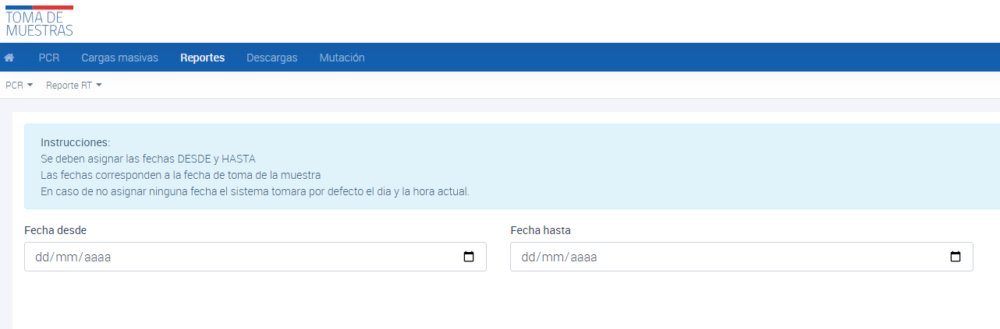

# Reporte Global de Solicitudes

El reporte global de solicitudes es una herramienta que permite a los usuarios obtener información sobre las muestras de prueba realizadas en la PNTM. 

Para generar este informe, los usuarios deben asignar una fecha de inicio (DESDE) y una fecha de finalización (HASTA) que correspondan a la fecha de toma de muestra. Si el usuario no asigna ninguna fecha, el sistema tomará automáticamente la fecha y hora actual como punto de partida y finalización para la generación del reporte.

El reporte global de solicitudes ofrece información detallada sobre el número total de muestras de prueba realizadas en la PNTM durante el período de tiempo especificado.

El reporte generado por la PNTM contiene información detallada sobre las muestras PCR y de antígenos, realizadas en establecimientos de salud pública en todo el país. 

Para acceder al reporte global de solicitudes de PCR, sigue estos pasos:

1. Accede al menú de reportes en la interfaz de usuario.
2. Selecciona el submenú de PCR en la lista de opciones disponibles.
3. Haz clic en el botón para generar el reporte global de solicitudes.
4. Selecciona las fechas "DESDE" y "HASTA" para definir el rango de tiempo que deseas incluir en el reporte. Ten en cuenta que estas fechas corresponden a la fecha de toma de la muestra.
5. Si no asignas ninguna fecha, el sistema tomará por defecto el día y la hora actual.

Una vez que ingreses las fechas requeridas, el reporte global de solicitudes de PCR se generará automáticamente y se descargará automáticamente a tu dispositivo en formato Excel.

_Reporte global de solicitudes_

_Reporte global de solicitudes_
