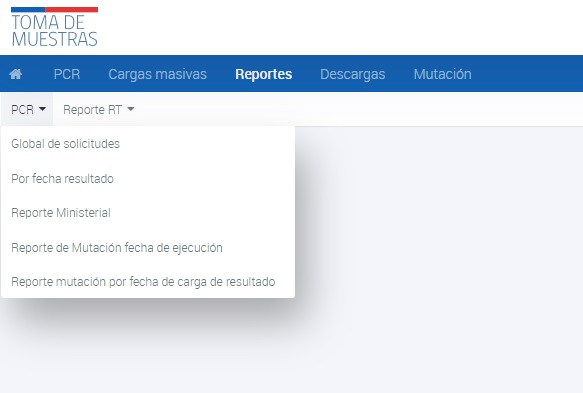

# Reporte Mutación por fecha de derivación

El Reporte Mutación por fecha de derivación es un informe generado por la Plataforma Nacional de Toma de Muestra (PNTM) que proporciona información detallada sobre las muestras de prueba que fueron enviadas a mutaciones. Este informe se enfoca en las muestras en estado 7, es decir, aquellas que fueron enviadas a mutaciones para su análisis.

Para generar el Reporte Mutación por fecha de derivación, sigue estas instrucciones:

- Ingresa a la interfaz de usuario del sistema.
- Haz clic en la opción de "Reportes".
- Selecciona el submenú de "PCR".
- Selecciona la opción de "Reporte Mutación por fecha de derivación".
- Se te pedirá que especifiques un rango de fechas para el reporte. Asegúrate de seleccionar una "fecha desde" y una "fecha hasta". Estas fechas corresponden a la fecha en que se tomó la muestra.
- Si no asignas ninguna fecha, el sistema tomará por defecto el día y la hora actual.
- Si el periodo de tiempo que seleccionas es mayor a 7 días (fecha desde y fecha hasta), el sistema no descargará datos.
- Una vez que ingreses las fechas requeridas, el Reporte Mutación por fecha de derivación se generará automáticamente y se descargará en formato excel

_Reporte Mutación por fecha de derivación_

El Reporte Mutación por fecha de derivación permite obtener información detallada sobre las muestras de prueba que fueron enviadas a mutaciones, lo que puede ser útil para el monitoreo de la propagación de variantes del virus.