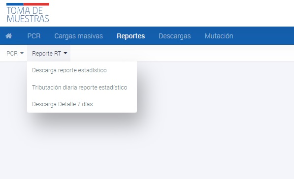

# Reporte de Resultados Acumulados RT

Este reporte presenta información sobre el número de muestras acumuladas, muestras acumuladas positivas y alerta de cuello de botella. A continuación se detallan las instrucciones para su uso:

Para generar el Reporte de Resultados Acumulados RT, sigue estas instrucciones:

- Ingresa a la interfaz de usuario del sistema.
- Haz clic en la opción de "Reportes".
- Selecciona el submenú de "Reporte RT".
- Selecciona la opción de "Descarga reporte estadístico".
- Se te pedirá que especifiques una fechas para el reporte.
- Si no asignas ninguna fecha, el sistema tomará por defecto el día y la hora actual.
- Una vez que ingreses las fechas requeridas, el Reporte de Resultados Acumulados RT se generará automáticamente y se descargará en formato excel

_Reporte de Resultados Acumulados RT_

## Contenido del reporte

El reporte se divide en cuatro secciones:

1. __Resultados Acumulados:__ Esta sección muestra el número total de muestras acumuladas y el número de muestras positivas hasta la fecha indicada en el reporte. Además, se indica si hay una alerta de cuello de botella en el proceso.
    
2. __Resultados obtenidos del sistema:__ Esta sección muestra información sobre el stock en espera, el número de muestras recibidas y procesadas en el día, el stock final, la capacidad máxima y la tasa de ocupación del día. También se muestra el número de muestras positivas obtenidas en el día.
    
    
3. __Resultados tributados por laboratorio:__ En esta sección se presenta información similar a la sección anterior, pero se detalla por laboratorio.
    
    
4. __Diferencias:__ Esta sección muestra las diferencias entre los resultados obtenidos del sistema y los resultados tributados por laboratorio.
    
    