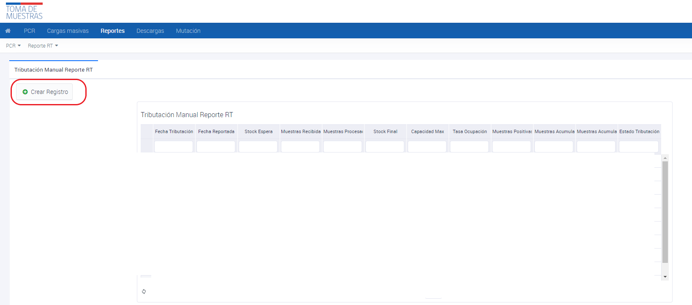
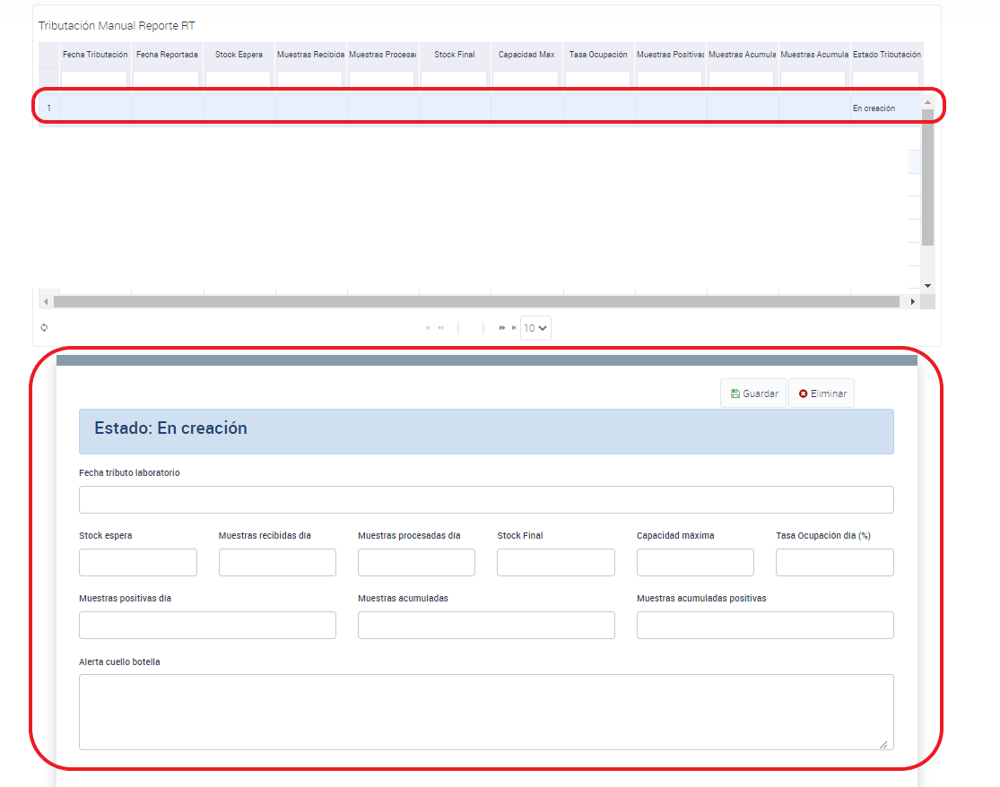

# Tributación Manual del Reporte RT

La Tributación Manual del Reporte RT es un proceso en el que los laboratorios pueden ingresar manualmente información diaria sobre el procesamiento de muestras en la Plataforma Nacional de Toma de Muestra (PNTM). Este informe proporciona datos sobre la fecha de tributo del laboratorio, el stock de muestras en espera, recibidas, procesadas y final, junto con la capacidad máxima, la tasa de ocupación diaria y las muestras positivas del día.

Para acceder a la tributación manual del Reporte RT, sigue estos pasos:

1. Ingresa a la interfaz de usuario del sistema.
2. Haz clic en la opción de "Reportes".
3. Selecciona el submenú de "Tributación Manual Reporte RT".
4. Haz clic en "Crear Registro".
5. Haz clic en la fila que se crea en la tabla principal, la cual tiene el estado "en creación".
6. Completa los datos del formulario.

_Figura 1: Tributación Manual del Reporte RT_

_Figura 2: Tributación Manual del Reporte RT_

## Tributación diaria reporte estadístico

- La fecha de tributo del laboratorio se debe ingresar manualmente en formato dd-mm-yyyy.
- Se deben ingresar manualmente los valores correspondientes a stock espera, muestras recibidas día, muestras procesadas día, stock final, capacidad máxima y muestras positivas día.
- El valor de tasa de ocupación día se calcula automáticamente al ingresar los valores de capacidad máxima y muestras procesadas día.
- Los valores de muestras acumuladas y muestras acumuladas positivas se obtienen de forma automática desde el reporte RT.
- Se puede incluir información adicional según sea necesario.