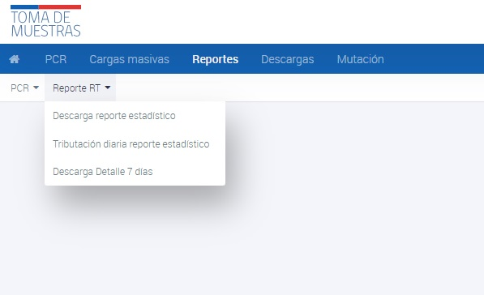

# Reporte RT - Descarga detalle 7 días

Este reporte presenta información relevante sobre el procesamiento y resultados de muestras en el laboratorio en los últimos 7 días.

Para generar el Reporte RT detalle de los ultimos 7 días, sigue estos pasos:

- Ingresa a la interfaz de usuario del sistema.
- Haz clic en la opción de "Reportes".
- Selecciona el submenú de "Reporte RT".
- Selecciona la opción de "Descarga Detalle 7 días".
- Se te pedirá que especifiques una fechas para el reporte.
- Si no asignas ninguna fecha, el sistema tomará por defecto el día actual.
- Una vez que ingreses las fechas requeridas, el Reporte de Resultados Acumulados RT se generará automáticamente y se descargará en formato excel

_Reporte RT - Descarga detalle 7 días_

A continuación se describen los campos que se incluyen en el reporte:

| Columna                              | Descripción |
|--------------------------------------|-------------|
| fecha_x_1                            | Día anterior a la fecha de resultado informado en reporte RT. |
| fecha_x                              | Fecha de resultado informado en reporte RT. |
| stock_espera_inf_pntm                | Muestras recepcionadas, pero sin procesar pendientes del día anterior a la fecha de resultado informado, considerando la fecha de recepción indicada por el laboratorio en PNTM. |
| muestras_recibidas_dia_inf_pntm      | Muestras recibidas el día de la fecha de resultado informado, considerando la fecha de recepción indicada por el laboratorio en PNTM. |
| stock_espera_sist_pntm               | Muestras recepcionadas, pero sin procesar pendientes del día anterior a la fecha de resultado informado, considerando la fecha de recepción indicada por el sistema en PNTM. |
| muestras_recibidas_dia_sist_pntm     | Muestras recibidas el día de la fecha de resultado informado, considerando la fecha de recepción indicada por el sistema en PNTM. |
| muestras_procesadas_dia_pntm         | Muestras procesadas por el laboratorio el día de la fecha de resultado informado en PNTM. |
| stock_final_inf_pntm                 | Stock final de muestras en espera o no procesadas el día de la fecha de resultado informado, considerando la fecha de recepción indicada por el laboratorio en PNTM. |
| stock_final_sist_pntm                | Stock final de muestras en espera o no procesadas el día de la fecha de resultado informado, considerando la fecha de recepción indicada por el sistema en PNTM. |
| tasa_ocupacion_dia_pntm              | Stock Final informado en PNTM / Capacidad máxima de procesamiento informada por el laboratorio en PNTM. |
| muestras_positivas_dia_pntm          | Muestras procesadas con resultado positivo el día de la fecha de resultado informado en PNTM. |
| stock_espera_trib                    | Muestras efectivamente recepcionadas en RT, pero sin procesar pendientes del día anterior a la fecha de resultado informado, considerando información del LIS del laboratorio. |
| muestras_recibidas_dia_trib          | Muestras efectivamente recibidas en RT el día de la fecha de resultado informado, considerando información del LIS del laboratorio. |
| muestras_procesadas_dia_trib         | Muestras efectivamente procesadas por el laboratorio el día de la fecha de resultado informado en RT, considerando información del LIS del laboratorio. |
| stock_final_trib                     | Stock final de muestras efectivamente en espera o no procesadas el día de la fecha de resultado informado en RT, considerando información del LIS del laboratorio. |
| capacidad_max_trib                   | Capacidad máxima de procesamiento informada por el laboratorio en RT. |
| tasa_ocupacion_dia_trib              | Stock Final informado en RT/ Capacidad máxima de procesamiento informada por el laboratorio en RT. |
| muestras_positivas_dia_trib          | Muestras procesadas con resultado positivo el día de la fecha de resultado informado en RT, considerando información del LIS del laboratorio. |
| muestras_acumuladas_trib             | Muestras acumul

