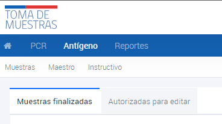
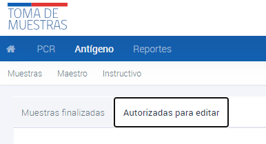

# Visualización estado de las muestras
{: .no_toc }

## Tabla de contenido
{: .no_toc .text-delta }
1. TOC
{:toc}

#  Visualización de Muestras del Perfil Comuna

## Visualización de Antígenos
- El alcance de la información se restringe a las muestras que el profesional registró.
- El usuario tiene acceso para visualizar las muestras registradas de los últimos 11 días.
- No tiene permiso para modificar las muestras.
- Tiene acceso para descargar reportes de los últimos 120 días.

## Visualización de PCR
- El alcance de la información se restringe a las muestras asociadas al Comuna.
- El usuario tiene acceso para visualizar las muestras registradas de los últimos 14 días.
- No tiene permiso para modificar las muestras.
- Tiene acceso para descargar reportes de los últimos 120 días.

# Visualización de Muestras PCR

## Visualización de Muestras PCR en proceso

1. Ingresar al sistema con el perfil de Comuna.
2. Navegar hasta la seccion **PCR**

los usuarios pueden visualizar el estado de las muestras que se encuentran en proceso o finalizadas en cada una de estas técnicas analíticas.

_Secciones **En proceso**, **Finalizados** y **Análisis de mutación**_

Las muestras **en proceso** son aquellas que se encuentran en la etapa analítica en el laboratorio al que fueron derivadas y aún no han sido informadas. Para buscar una muestra, se debe ingresar alguno de los datos conocidos y presionar ENTER. Si la muestra no aparece en esta pantalla, es posible que ya se encuentre en la sección de **Finalizadas**.

Si se tiene conocimiento de que el resultado está listo pero no se ha ingresado, se debe informar al Servicio de Salud para que el laboratorio regularice la situación. Esto asegura que la información esté actualizada y disponible para el Comuna y los profesionales pertinentes, permitiendo una atención adecuada y oportuna a los pacientes.

## Visualización de Muestras PCR finalizadas

Las muestras **finalizadas** son los resultados de las muestras que ya han sido informadas y tienen un resultado disponible. Para buscar una muestra, se debe ingresar alguno de los datos conocidos y presionar ENTER. Si no se encuentra la muestra en **Finalizadas** o **En proceso**, es probable que la muestra no haya sido ingresada en el perfil del Comuna correspondiente.

## Visualización de Muestras PCR analisis de mutación

Además, hay una sección de **Análisis de mutación**, donde los usuarios pueden encontrar las muestras enviadas para análisis.

# Visualización de Muestras de Antigenos

## Visualización de Muestras finalizadas de Antigenos

1. Ingresar al sistema con el perfil de Comuna.
2. Navegar hasta la seccion **Antígenos**
3. Hacer click en **Muestras finalizadas**

Las **muestras finalizadas** son los resultados de las muestras que ya han sido informadas y tienen un resultado disponible. Para buscar una muestra, se debe ingresar alguno de los datos conocidos y presionar ENTER.

## Visualización de Muestras Autorizadas para editar de Antigenos

1. Ingresar al sistema con el perfil de Comuna.
2. Navegar hasta la seccion **Antígenos**
3. Hacer click en **Autorizadas para editar**

Las muestras autorizadas para editar son aquellas que han sido informadas pero, por alguna razón, requieren correcciones o modificaciones en la información ingresada previamente. Estas muestras pueden ser editadas por los usuarios con los permisos adecuados. Para buscar una muestra en esta sección, se debe ingresar alguno de los datos conocidos y presionar ENTER.

