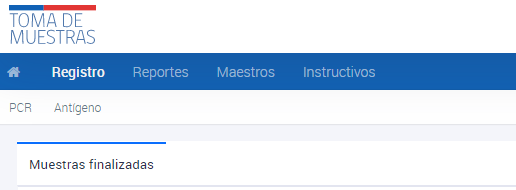

# Visualización estado de las muestras
{: .no_toc }

## Tabla de contenido
{: .no_toc .text-delta }
1. TOC
{:toc}

# Visualización de Muestras de Antígenos
1. Ingresar al sistema con el perfil de Comuna.
2. Navegar hasta la sección **Registro**.
3. Ir a la subsección **Antígeno**.
4. Hacer clic en **Muestras finalizadas**.

Las **muestras finalizadas** son los resultados de las muestras que ya han sido informadas y tienen un resultado disponible. Para buscar una muestra, se debe ingresar alguno de los datos conocidos y presionar ENTER.
