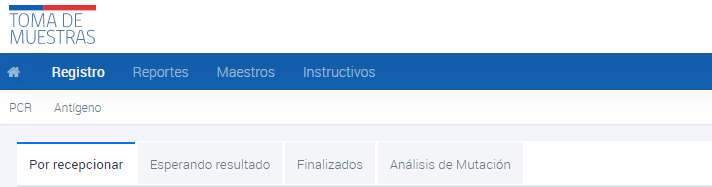
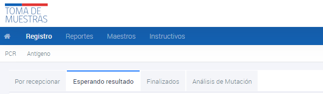
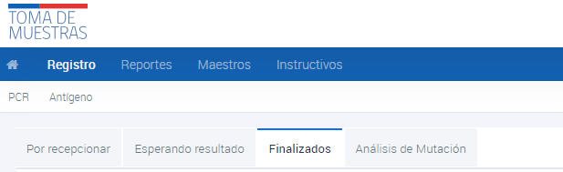
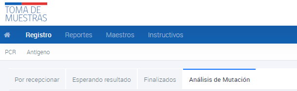

# Visualización estado de las muestras
{: .no_toc }

## Tabla de contenido
{: .no_toc .text-delta }
1. TOC
{:toc}

## Visualización de Muestras PCR por recepcionar

1. Ingresar al sistema con el perfil de Comuna.
2. Navegar hasta la sección **Registro**.
3. Ir a la subsección **PCR**.
4. Hacer clic en **Por recepcionar**.

Las muestras **Por recepcionar** son aquellas que han sido enviadas al laboratorio pero aún no han sido confirmadas como recibidas por el laboratorio para su análisis. Para buscar una muestra, se debe ingresar alguno de los datos conocidos y presionar ENTER. Si la muestra no aparece en esta pantalla, es posible que ya se encuentre en la sección de Finalizadas.

Si se tiene conocimiento de que el resultado está listo pero no se ha ingresado, se debe informar al Servicio de Salud para que el laboratorio regularice la situación. Esto asegura que la información esté actualizada y disponible para la Comuna y los profesionales pertinentes, permitiendo una atención adecuada y oportuna a los pacientes.

## Visualización de Muestras PCR esperando resultado

1. Ingresar al sistema con el perfil de Comuna.
2. Navegar hasta la sección **Registro**.
3. Ir a la subsección **PCR**.
4. Hacer clic en **Esperando resultado**.

Las muestras **esperando resultado** son aquellas que han sido confirmadas como recibidas por el laboratorio y se encuentran en proceso de análisis, pero aún no tienen un resultado disponible. Para buscar una muestra, se debe ingresar alguno de los datos conocidos y presionar ENTER.

## Visualización de Muestras PCR finalizadas

1. Ingresar al sistema con el perfil de Comuna.
2. Navegar hasta la sección **Registro**.
3. Ir a la subsección **PCR**.
4. Hacer clic en **Finalizados**.

Las muestras **finalizadas** son los resultados de las muestras que ya han sido informadas y tienen un resultado disponible. Para buscar una muestra, se debe ingresar alguno de los datos conocidos y presionar ENTER.

## Visualización de Muestras PCR análisis de mutación

1. Ingresar al sistema con el perfil de Comuna.
2. Navegar hasta la sección **Registro**.
3. Ir a la subsección **PCR**.
3. Hacer clic en **Análisis de mutación**.

Además, hay una sección de **Análisis de mutación**, donde los usuarios pueden encontrar las muestras enviadas para análisis. Para buscar una muestra en esta sección, se debe ingresar alguno de los datos conocidos y presionar ENTER.
