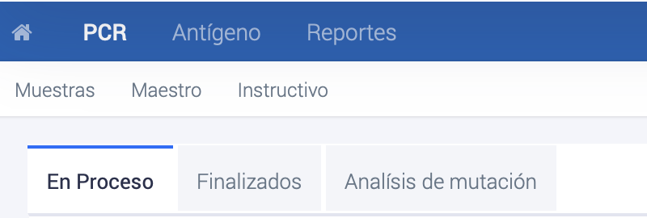

# Visualización estado de las muestras
{: .no_toc }

## Tabla de contenido
{: .no_toc .text-delta }
1. TOC
{:toc}

Dentro de las secciones **PCR**, **Antígeno** y **Análisis de mutación**, los usuarios pueden visualizar el estado de las muestras que se encuentran en proceso o finalizadas en cada una de estas técnicas analíticas.

_Secciones **PCR**, **Antígeno** y **Análisis de mutación**_

Las muestras **en proceso** son aquellas que se encuentran en la etapa analítica en el laboratorio al que fueron derivadas y aún no han sido informadas. Para buscar una muestra, se debe ingresar alguno de los datos conocidos y presionar ENTER. Si la muestra no aparece en esta pantalla, es posible que ya se encuentre en la sección de **Finalizadas**.

Las muestras **finalizadas** son los resultados de las muestras que ya han sido informadas y tienen un resultado disponible. Para buscar una muestra, se debe ingresar alguno de los datos conocidos y presionar ENTER. Si no se encuentra la muestra en **Finalizadas** o **En proceso**, es probable que la muestra no haya sido ingresada en el perfil del establecimiento correspondiente.

Además, hay una sección de **Análisis de mutación**, donde los usuarios pueden encontrar las muestras enviadas para análisis.

Si se tiene conocimiento de que el resultado está listo pero no se ha ingresado, se debe informar al Servicio de Salud para que el laboratorio regularice la situación. Esto asegura que la información esté actualizada y disponible para el establecimiento y los profesionales pertinentes, permitiendo una atención adecuada y oportuna a los pacientes.