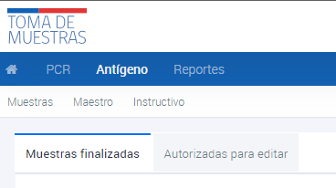
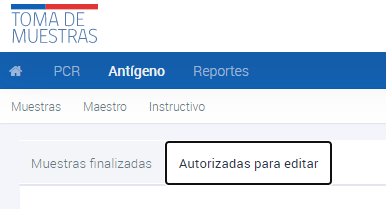

# Visualización estado de las muestras
{: .no_toc }

## Tabla de contenido
{: .no_toc .text-delta }
1. TOC
{:toc}

# Visualización de Muestras de Antígenos

## Visualización de Muestras de Antígenos finalizadas 

1. Ingresar al sistema con el perfil de Establecimiento.
2. Navegar hasta la sección **Antígenos**.
3. Hacer clic en **Muestras finalizadas**.

Las **muestras finalizadas** son los resultados de las muestras que ya han sido informadas y tienen un resultado disponible. Para buscar una muestra, se debe ingresar alguno de los datos conocidos y presionar ENTER.

## Visualización de Muestras de Antígenos autorizadas para editar 

1. Ingresar al sistema con el perfil de Establecimiento.
2. Navegar hasta la sección **Antígenos**.
3. Hacer clic en **Autorizadas para editar**.

Las **muestras autorizadas para editar** son aquellas que han sido informadas pero, por alguna razón, requieren correcciones o modificaciones en la información ingresada previamente. Estas muestras pueden ser editadas por los usuarios con los permisos adecuados. Para buscar una muestra en esta sección, se debe ingresar alguno de los datos conocidos y presionar ENTER.
