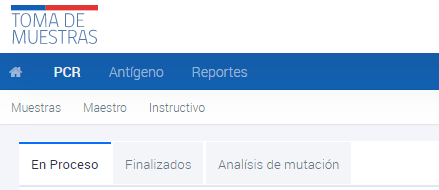
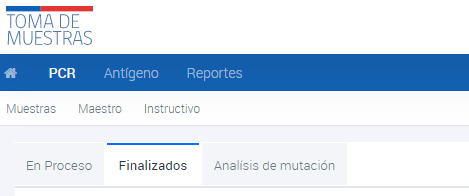

# Visualización estado de las muestras
{: .no_toc }

## Tabla de contenido
{: .no_toc .text-delta }
1. TOC
{:toc}

## Visualización de Muestras PCR en proceso

1. Ingresar al sistema con el perfil de SEREMI.
2. Navegar hasta la sección **PCR**.
3. Hacer clic en **Muestras en proceso**.

Las muestras **en proceso** son aquellas que se encuentran en la etapa analítica en el laboratorio al que fueron derivadas y aún no han sido informadas. Para buscar una muestra, se debe ingresar alguno de los datos conocidos y presionar ENTER. Si la muestra no aparece en esta pantalla, es posible que ya se encuentre en la sección de **Finalizadas**.

Si se tiene conocimiento de que el resultado está listo pero no se ha ingresado, se debe informar al Servicio de Salud para que el laboratorio regularice la situación. Esto asegura que la información esté actualizada y disponible para el SEREMI y los profesionales pertinentes, permitiendo una atención adecuada y oportuna a los pacientes.

## Visualización de Muestras PCR finalizadas

1. Ingresar al sistema con el perfil de SEREMI.
2. Navegar hasta la sección **PCR**.
3. Hacer clic en **Muestras finalizadas**.

Las muestras **finalizadas** son los resultados de las muestras que ya han sido informadas y tienen un resultado disponible. Para buscar una muestra, se debe ingresar alguno de los datos conocidos y presionar ENTER. Si no se encuentra la muestra en **Finalizadas** o **En proceso**, es probable que la muestra no haya sido ingresada en el perfil del SEREMI correspondiente.

## Visualización de Muestras PCR análisis de mutación

1. Ingresar al sistema con el perfil de SEREMI.
2. Navegar hasta la sección **PCR**.
3. Hacer clic en **Análisis de mutación**.

Además, hay una sección de **Análisis de mutación**, donde los usuarios pueden encontrar las muestras enviadas para análisis. Para buscar una muestra en esta sección, se debe ingresar alguno de los datos conocidos y presionar ENTER.
