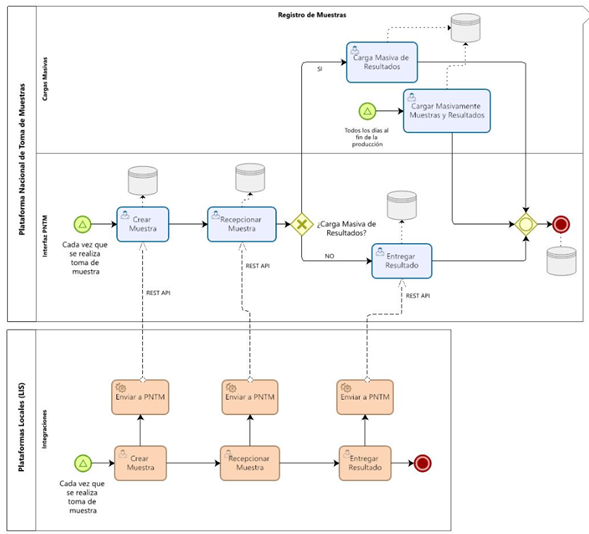
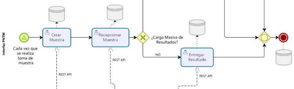
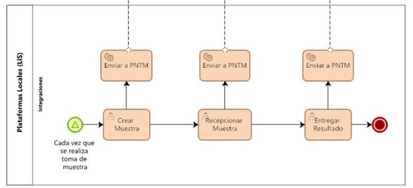
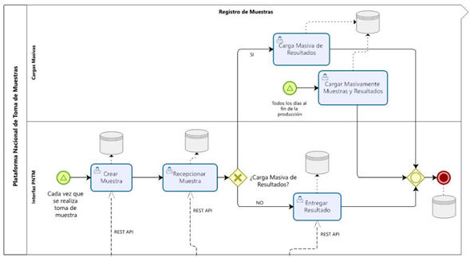

 

- [Plataforma Nacional de Toma de Muestras](#plataforma-nacional-de-toma-de-muestras)
  - [¿Quiénes deberán utilizar esta plataforma?](#quiénes-deberán-utilizar-esta-plataforma)
  - [Métodos de registro en PNTM](#métodos-de-registro-en-pntm)
  - [Ingreso vía interfaz](#ingreso-vía-interfaz)
    - [Creación de muestras](#creación-de-muestras)
    - [Recepción de muestras](#recepción-de-muestras)
    - [Entrega de resultados](#entrega-de-resultados)
  - [Registro vía API](#registro-vía-api)
    - [Creación de muestras](#creación-de-muestras-1)
    - [Recepción de muestras](#recepción-de-muestras-1)
    - [Entrega de resultados](#entrega-de-resultados-1)
  - [Carga masiva de muestras y/o resultados](#carga-masiva-de-muestras-yo-resultados)
    - [Carga de resultados](#carga-de-resultados)
    - [Carga de muestras y resultados](#carga-de-muestras-y-resultados)

# Plataforma Nacional de Toma de Muestras

 
La plataforma tiene por objetivo implementar un sistema de registro y trazabilidad en tiempo real para todas las prestaciones de laboratorio clínico y/o biología molecular que se ejecuten en el país en apoyo al diagnóstico de SARS-CoV 2, permitiendo el ingreso de información por parte del profesional de toma de muestra y su posterior acceso restringido al informe de resultados emitido por el laboratorio clínico.

Para definir su uso, cada Servicio de Salud o institución publico/privada debe revisar sus procesos de generación de información desde la toma de muestra y asegurar la trazabilidad, considerando en la eventualidad de que un centro no disponga de registro informático de trazabilidad de los casos, la obligatoriedad de la implementación.

Tomando lo anterior, esta plataforma será la única vía de registro de información de exámenes para coronavirus validado desde el Ministerio de Salud, para llevar el registro centralizado de la técnica diagnóstica y será utilizada además para entregar diariamente reportes a las Autoridades respectivas. 

## ¿Quiénes deberán utilizar esta plataforma?

 
-	Profesionales y técnicos que desempeñan funciones de toma de muestra en los distintos centros y establecimientos de salud, quienes deberán registrar los antecedentes de la toma de muestra.

-	Profesionales responsables de laboratorio clínico y/o biología molecular de establecimientos donde se ejecute exámenes diagnósticos de SARS-CoV 2 en el país, quienes deberán supervisar el adecuado traspaso de la información desde el Sistema Informático de Laboratorio (LIS) a esta plataforma ministerial de registro nacional. 

Cabe destacar que tanto los profesionales de toma de muestra como los profesionales de laboratorio tienen accesos diferenciados, dado sus roles, en la plataforma. 

## Métodos de registro en PNTM

 
Plataforma Nacional de Toma de Muestras cuenta con distintos métodos de registro de muestras para facilitar la integración, registro sincrónico y adaptabilidad a procesos clínicos. Existe actualmente tres tipos de ingresos de información a PNTM, los cuales corresponden a Interfaz, API y Carga masivas mediante .CSV.

 

## Ingreso vía interfaz

El registro mediante interfaz corresponde a toda muestra que es ingresada directamente desde [tomademuestras.minsal.cl](https://tomademuestras.minsal.cl), dentro del registro de interfaz existen tres hitos de registro importantes, los que corresponden a Creación de muestras, Recepción de muestras y Entrega de resultados.

 

### Creación de muestras
La creación de muestra es un proceso llevado a cabo por el profesional de toma de muestra, quien debe ingresar a PNTM con su respectivo usuario y registrar todos los campos solicitados por la plataforma. El registro en el sistema debe ser de manera sincrónica al acto clínico realizado.
### Recepción de muestras
La recepción de muestra es un proceso llevado a cabo por el laboratorio que recibe la muestra creada. En donde un profesional designado debe ingresar con el perfil de acceso del laboratorio y generar al acto de recepción de muestra. El registro en el sistema debe ser de manera sincrónica con el acto de recepción realizado.
### Entrega de resultados
Cada laboratorio tiene la obligación de registrar resultados de muestras procesadas mediante PNTM, para realizar dicho proceso es necesario que un profesional designado ingrese a plataforma con el perfil de usuario de laboratorio, para luego realizar la entrega de resultados a cada una de las muestras procesadas. El registro en sistema debe ser de manera sincrónica con el acto de entrega de resultado.

## Registro vía API
El registro mediante API corresponde a toda muestra que es ingresada mediante el uso de Web Service puesto a disposición para generar interoperabilidad entre laboratorios y PNTM. Dentro de los servicios disponibles para el consumo se encuentra la creación de muestras, recepción de muestras y entrega de resultados.

 

### Creación de muestras
Dentro de los métodos de servicio disponibles en el Web Service, existe la creación de muestras. La cual permite a todo laboratorio mediante el uso de API crear muestras, lo que facilita y apunta a la integración de procesos desde sistemas informáticos locales de laboratorio (LIS) a PNTM, de esta manera generar cohesión de registro en ambos sistemas.
### Recepción de muestras
Dentro de los métodos de servicio disponibles en el Web Service, existe la recepción de muestras. La cual permite a todo laboratorio mediante el uso de API recepcionar muestras, lo que facilita y apunta a la integración de procesos desde sistemas informáticos locales de laboratorio (LIS) a PNTM, de esta manera generar cohesión de registro en ambos sistemas.
### Entrega de resultados
Dentro de los métodos de servicio disponibles en el Web Service, existe la entrega de resultados. La cual permite a todo laboratorio mediante el uso de API entregar resultados, lo que facilita y apunta a la integración de procesos desde sistemas informáticos locales de laboratorio (LIS) a PNTM, de esta manera generar cohesión de registro en ambos sistemas.

## Carga masiva de muestras y/o resultados
En paralelo a los dos métodos expuestos anteriormente, existe un tercero, el cual viene a complementar y en ayuda de laboratorios que no cuenten con el personal ni la infraestructura TIC necesaria para el registro por Interfaz o por medio de Interoperabilidad (vía API).

 

### Carga de resultados
Dentro de los métodos de carga masiva se encuentra la carga masiva de resultados, la cual viene en ayuda a descomprimir el trabajo administrativo realizado por los laboratorios en cuanto a entrega de resultado uno a uno vía interfaz. Este método particular es realizado por algún profesional designado por el laboratorio, quien debe ingresar a PNTM y cargar el archivo Excel en donde se debe registrar el identificador de la muestra (ID PNTM) y el resultado en la columna adjunta, de esta manera el archivo es subido y cargado los resultados de las muestras en cuestión.

### Carga de muestras y resultados
La segunda opción de carga masiva corresponde al registro de muestras y resultados dentro de un solo archivo. Este método en particular tiene la finalidad de poder gestionar la carga de las muestras que no fueron cargadas por ninguno de los métodos anteriores. Permitiendo a los usuarios de laboratorio mayor rapidez en el registro de muestras.
