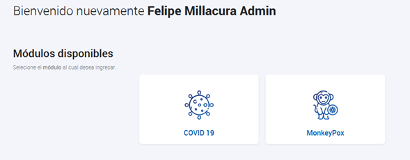

- [Desarrollos PNTM](#desarrollos-pntm)
  - [2022-09-08](#2022-09-08)
  - [2022-09-01](#2022-09-01)
  
## Desarrollos PNTM

- - - 
### 2022-09-08

  -	Se realizan arreglos menores en el acceso a la plataforma. Se habilita acceso a dos módulos, uno para COVID 19 y otro para MonkeyPox
 

  

 
  - Estos perfiles están disponibles para todos los tomadores de muestra, pero solo laboratorios autorizados a procesar muestras de PCR Monkeypox, por el ISP, podrán hacer uso del módulo y recibir muestras a través de PNTM.
  -	Tipos de muestras presentes en MonkeyPox son `Tórula de Lesión` y `Contenido Vesicular` 
  -	El modulo MonkeyPox se encuentra presente con funcionalidades de carga vía interfaz, carga Masiva y vía API solo para el endpoint `/crearmuestrasmp` documentación presente en [APIDOCS](https://tomademuestras.apidocs.openagora.org/)
-	Endpoints de `/recepcionarMuestra` y `/entregaResultado` para MonkeyPox se encuentran en proceso de desarrollo

- *Respecto a módulo COVID 19:*

Con motivo de solucionar carga incorrecta de tomadores de muestra, profesionales responsables y médicos. Se han diferenciado los campos de *Tomador de Muestra*, *Profesional Responsable* y *Medico Solicitante*.

En el caso de ser búsqueda activa, se deberá agregar el Rut del Tomador de muestra, y el RUT de un profesional responsable (debe ser profesional)
 

  

 
 
*__Datos presentes en la imagen de manera referencial, no corresponden a datos reales__

-	De ser un caso de *Atención Médica*, aparecerá el campo de *Médico Solicitante*, donde deberá usarse el RUT de un médico registrado en PNTM. De esta forma desde NC podremos rastrear quienes reportan muestras de diagnóstico utilizando perfiles técnicos y no profesionales. El Profesional responsable hace referencia al profesional tomador de la muestra o a algún profesional responsable de validar el resultado. __Esto se encuentra aún en desarrollo y será implementado en Interfaz y Carga Masiva la próxima semana.__

-	El desarrollo vía API de esta funcionalidad será implementado en el nuevo endpoint `/crearMuestras_v3` el cual también posee la funcionalidad de procesar todas las muestras de manera individual, cargando las muestras correctas y devolviendo las erróneas. Lo anterior viene a solucionar la caída de la carga completa cuando hay solo algunas muestras erróneas. Una vez realizados los desarrollos vía API, se bajará la información vía ordinario y tendrán un mes para migrar al nuevo endpoint `/crearMuestras_v3` y `/recepcionarMuestraV3`.

-	Se está trabajando en una modernización de la documentación de PNTM (`pntmdocs`), permitiendo búsqueda por temas, conteniendo preguntas frecuentes e incluyendo capsulas de ejemplo para cada tipo de proceso que se realiza (entre otras opciones). Además, se utilizarácomo medio oficial para bajar de forma rápida y oportuna los desarrollos realizados, junto a códigos ejemplo de integraciones vía API de los WS.

Estos desarrollos son los planificados a implementarse durante el mes de Septiembre 2022

- - - 

### 2022-09-01

**Nuevas funcionalidades:**

-	Se agregó la variable `Estrategia` a reporte global de solicitudes de antígeno
-	Se agrega la variable `Estrategia` al testeo NO BAC, adicionando los valores `Sintomáticos` y `Residencias Sanitarias`
-	Valor de variable Estrategia `BAC autotest` se permite tributar solo con marcas de test autorizadas para dicho programa piloto
-	Estrategia sigue siendo opcional y tiene valor por defecto `Sin Estrategia` tanto para BAC como no BAC

**Corrección de errores:**

-	Se agrego restricción para Rut de pacientes en blanco, ocasionado por bug que aparecía al seleccionar y deseleccionar el tipo de documento del paciente
-	Se ocultan las variables de recepción y resultado de antígeno desde interfaz de antígeno
-	Se corrige bug que permitía que ciertos establecimientos y laboratorios tributaran incorrectamente muestras de PCR sin RUT de profesional responsable. Se agrega restricción a Interfaz, Carga Masiva y API:

  o	Vía interfaz se diferencia entre el RUT Tomador de Muestra y el Rut Profesional Solicitante/ Responsable
 

  

 
o	Via Carga Masiva:
Se diferencia entre rut_tomador_muestra y rut_profesional_solicitante (RUT del profesional que es reponsable o que solicita la muestra, e.g. Medico)
 

  

 

**Via API:**

No se realiza cambio de nombres de variables para no afectar interoperabilidad [APIDOCS](https://tomademuestras.apidocs.openagora.org/#/). Pero en caso de utilizar búsqueda_activa = `False` deben utilizar el campo rut_responsable con el de tomador de muestra (tal como lo hacían a la fecha) y rut_medico con el RUT del médico solicitante. En caso de elegir búsqueda_activa = `True` deben utilizar el campo `rut_responsable` con el de tomador de muestra (tal como lo hacían a la fecha) y `rut_medico` con el RUT del profesional responsable.
 

  

 
Estos nombres de variables presentes via API serán corregidos posteriormente para mayor claridad, al igual que como se realizó en Carga Masiva e Interfaz
- - - 
