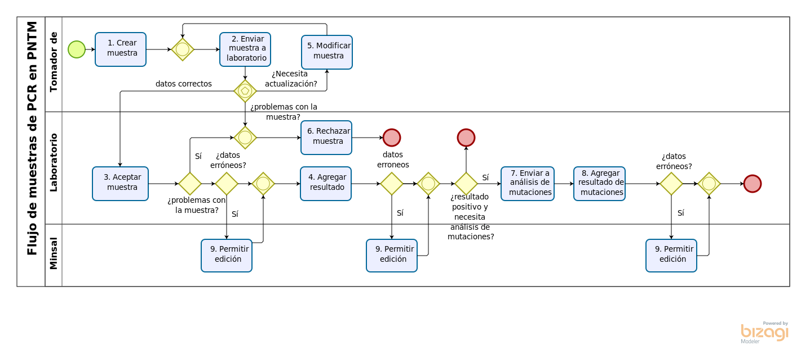
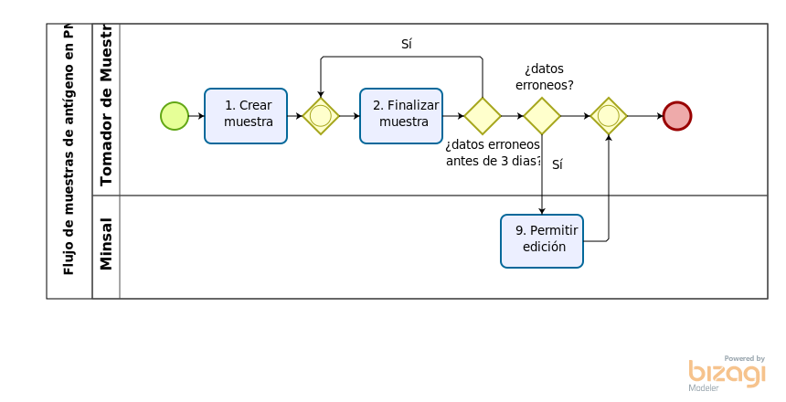

<!-- Edit the content below for the workshop in question. Once you're ready to publish, remove the comment characters e.g. "<!--" at the start and end 

-->
- [Flujos de PNTM](#flujos-de-pntm)
  - [1. Flujos de PCR](#1-flujos-de-pcr)
  - [2. Flujos de Antigeno](#2-flujos-de-antigeno)
# Flujos de PNTM

## 1. Flujos de PCR

## 2. Flujos de Antigeno

